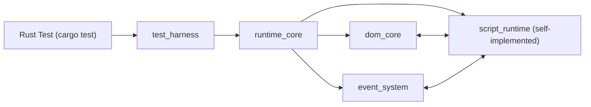

# browser-tester

A deterministic browser-like testing crate implemented entirely in Rust.

- Japanese README: [translations/ja/README.md](translations/ja/README.md)
- Developed by [Finite Field, K.K.](https://finitefield.org)

## Purpose

- Provide a runtime that can execute DOM and script tests deterministically within a single process.
- Enable browser interaction tests without depending on an external browser, WebDriver, or Node.js.

## Usage

1. Create a test harness from HTML.
2. Operate elements using selectors.
3. Assert the expected DOM state.

```rust
use browser_tester::Harness;

fn main() -> browser_tester::Result<()> {
    let html = r#"
      <input id='name' />
      <button id='submit'>Submit</button>
      <p id='result'></p>
      <script>
        document.getElementById('submit').addEventListener('click', () => {
          const name = document.getElementById('name').value;
          document.getElementById('result').textContent = `Hello, ${name}`;
        });
      </script>
    "#;

    let mut harness = Harness::from_html(html)?;
    harness.type_text("#name", "Alice")?;
    harness.click("#submit")?;
    harness.assert_text("#result", "Hello, Alice")?;
    Ok(())
}
```

Run tests:

```bash
cargo test
```

## Runtime Policy

- `eval` is intentionally not implemented to preserve security and determinism.
- Time APIs are based on a fake clock and provide `Date.now()` and `performance.now()`.

## Test Mocks

- `fetch` is designed to be replaced with mocks during tests.
- `confirm` / `prompt` provide APIs for injecting mocked return values.
- Main APIs:
  - `Harness::set_fetch_mock(url, body)`
  - `Harness::enqueue_confirm_response(bool)`
  - `Harness::enqueue_prompt_response(Option<&str>)`

Developed by [Finite Field, K.K.](https://finitefield.org)

## Full Design Document

The following content is synchronized with `doc/e2e-lite-runtime-design.md`.

# Lightweight HTML+JS Test Runtime Design (Rust)

## 1. Background and Goals

Browser-launch-based E2E approaches like `chromedp` have high overhead in startup, rendering, networking, and inter-process communication, which often slows feedback.
This design defines a Rust test runtime for **a single HTML file (inline JS only)** to quickly validate DOM and event behavior.

Main goals:
- Quickly execute form input, checkbox operations, button clicks, and result text assertions.
- Run tests as Rust unit tests.
- Avoid aiming for 100% real-browser compatibility; instead, provide stable behavior within the required scope.

## 2. Scope

### 2.1 In Scope
- Load one HTML string and build a DOM.
- Execute inline `<script>`.
- DOM operations (`querySelector`, `getElementById`, `textContent`, `value`, `checked`).
- Event system (`click`, `input`, `change`, `submit`).
- Capture/bubble, `preventDefault`, `stopPropagation`.
- Test harness API (actions + assertions).
- Diff output on failure.

### 2.2 Out of Scope
- Loading external CSS/JS files.
- Real network I/O (XHR/WebSocket/external HTTP). `fetch` is supported only through mock injection.
- Screen rendering, layout calculation, style application, accessibility tree.
- iframe, shadow DOM, custom elements (not supported in MVP).

## 3. Requirements

### 3.1 Functional Requirements
1. Initialize HTML with `Harness::from_html`.
2. Call `type_text`, `set_checked`, `click`, and `submit`.
3. Update DOM via JS event handlers.
4. Support `assert_text`, `assert_value`, `assert_checked`, and `assert_exists`.
5. Show both actual and expected values for selector targets on failure.

### 3.2 Non-Functional Requirements
- Target several milliseconds to several tens of milliseconds per unit test case (depends on HTML size).
- Full test isolation between test cases (prevent state leaks).
- Deterministic execution (time, randomness, and async can be fixed).

## 4. Overall Architecture



Modules:
- `dom_core`: DOM tree, selectors, attributes/properties.
- `script_runtime`: custom parser + custom evaluator (JS subset).
- `event_system`: event propagation and default actions.
- `runtime_core`: initialization, script execution, task queue.
- `test_harness`: high-level test operation API.

## 5. Crate Structure (Adopted Policy)

- This project is implemented as a **single crate**.
- Centered on `src/lib.rs`, with module splitting inside the same crate as needed.
- No separate-crate split such as `runtime-core` / `dom-core`.

## 6. DOM Model Details

### 6.1 Data Structures
- Arena style (`Vec<Node>`) + `NodeId(usize)`.
- Each node:
  - `node_type`: Document / Element / Text
  - `parent: Option<NodeId>`
  - `children: Vec<NodeId>`
  - `tag_name` (Element only)
  - `attributes: HashMap<String, String>`
  - `properties: ElementProperties`

`ElementProperties` (MVP):
- `value: String` (input/textarea/select)
- `checked: bool` (checkbox/radio)
- `disabled: bool`
- `readonly: bool`
- `required: bool`

### 6.2 Indexes
- `id_index: HashMap<String, Vec<NodeId>>`
- `class_index: HashMap<String, Vec<NodeId>>` (when needed)
- `#id` / `getElementById` returns the first element for a given id, while duplicate ids are kept internally.

### 6.3 Selectors
MVP support:
- Simple/compound: `#id`, `.class`, `tag`, `[name]`, `[name=value]`,
  `tag#id.class[attr=value][attr2]`
- Combinators: descendant (space), child (`>`), adjacent sibling (`+`), general sibling (`~`)
- Groups: `A, B` (deduplicate and return in document order)

Unsupported selectors must return explicit errors (no silent ignore).

## 7. Script Runtime Details

### 7.1 Implementation Approach
- Do not use an external JS engine (pure Rust implementation).
- Parse `<script>` strings into AST with a custom parser and execute with a custom evaluator.
- Limit support to the JS subset needed for tests; unsupported syntax fails explicitly with `ScriptParse`.

### 7.2 Supported Syntax/DOM APIs (Main)
- Listener registration/removal: `addEventListener(...)`, `removeEventListener(...)`
- Control flow: `if/else`, `while`, `do...while`, `for`, `for...in`, `for...of`, `break`, `continue`, `return`
- Main operators: ternary, logical/comparison/strict comparison, arithmetic, bitwise, assignment operators (`+=`, `&&=`, `??=`, etc.)
- Numeric literals: integer/decimal/exponent/hex/octal/binary, BigInt literals
- DOM references: `getElementById`, `querySelector`, `querySelectorAll`, `querySelectorAll(...).length`,
  `form.elements.length`, `form.elements[index]`,
  `new FormData(form)`, `formData.get(name)`, `formData.has(name)`,
  `formData.getAll(name).length`
- DOM updates: `textContent`, `value`, `checked`, `disabled`, `readonly`, `required`, `className`, `id`, `name`, `classList.*`,
  `setAttribute/getAttribute/hasAttribute/removeAttribute`, `dataset.*`, `style.*`,
  `matches(selector)`, `closest(selector)` (returns `null` when not matched),
  `getComputedStyle(element).getPropertyValue(property)`,
  `createElement/createTextNode`, `append/appendChild/prepend/removeChild/insertBefore/remove()`,
  `before/after/replaceWith`, `insertAdjacentElement/insertAdjacentText/insertAdjacentHTML`, `innerHTML`
- Timers: `setTimeout(callback, delayMs?)` / `setInterval(callback, delayMs?)`
  (returns timer ID. No real-time waiting; execute via `harness.advance_time(ms)` / `harness.flush()`),
  `clearTimeout(timerId)` / `clearInterval(timerId)`,
  `requestAnimationFrame` / `cancelAnimationFrame`, `queueMicrotask`
- Time: `Date.now()` / `performance.now()` (returns current fake clock value `now_ms`)
- Random: `Math.random()` (returns deterministic PRNG float `0.0 <= x < 1.0`)
- Mock-oriented APIs: `fetch`, `matchMedia`, `alert`, `confirm`, `prompt`
- Events: `preventDefault`, `stopPropagation`, `stopImmediatePropagation`
- `offsetWidth`, `offsetHeight`, `offsetTop`, `offsetLeft`, `scrollWidth`, `scrollHeight`, `scrollTop`, `scrollLeft` (minimal implementation returns numeric values)

#### 7.2.1 Priority for Unsupported DOM APIs
- First priority: DOM references/updates required for tests (`getElementById`, `querySelector*`, `textContent`, `value`, `checked`, `disabled`, `readonly`, `required`, `classList`, `dataset`, `style`, `append*`/`remove*` family)
- Second priority: timer/event/form APIs (`setTimeout`, `setInterval`, `clearTimeout`, `clearInterval`, `preventDefault`, `FormData`, `submit`)
- Third priority: display/measurement APIs such as `focus`
- Unsupported cases must fail explicitly in `ScriptParse`/`ScriptRuntime` layers (no silent ignore)
- Preferred expansion order: `dataset/style` -> DOM events -> `offset/scroll` (minimal read support) -> other display/measurement APIs

#### 7.2.2 Parser Decision Order (Implementation Note)
- For expressions such as `event.currentTarget` and `document.getElementById(...).matches(...)`/`closest(...)`,
  resolve `event`/`DOM method` cases before `DomRef` matching (to avoid misinterpreting `document.getElementById(...).textContent`).
- This order avoids known `ScriptParse` edge cases (name collisions between `event` and DOM properties).

Simplified `FormData` spec (for testing):
- `new FormData(form)` scans `form.elements` and creates a snapshot.
- Only valid controls with `name` are included (`disabled` and `button/submit/reset/file/image` are excluded).
- For checkbox/radio, only `checked=true` entries are included; if `value` is empty, use `"on"`.
- `.get(name)` returns the first value, or empty string if missing.
- `.has(name)` returns key presence.
- `.getAll(name).length` returns the number of values for the same key.
- `formData.append(name, value)` appends to the end (supported only as statements against a `FormData` variable).
- Initial `textarea` value uses the element body text.
- Initial `select` value prefers `option` with `selected`; otherwise uses the first `option`.
- If an `option` has no `value` attribute, use the `option` text as value.
- On `select.value = x`, one matching `option` is selected and others are unselected.

### 7.3 Rust <-> Script Bridge
- Access DOM through `DomQuery`/`DomProp` inside AST nodes.
- When executing events, pass `EventState` and local variable environment `env` into the evaluator.
- Synchronize `id_index` as needed when DOM updates occur.

## 8. Event System Details

### 8.1 Event Object
Fields:
- `type`, `target`, `currentTarget`, `bubbles`, `cancelable`, `defaultPrevented`, `isTrusted`
- `eventPhase`, `timeStamp`
- Reference properties: `targetName`, `currentTargetName`, `targetId`, `currentTargetId`
- Internal controls: `propagation_stopped`, `immediate_propagation_stopped`

### 8.2 Propagation Algorithm
1. Build path from `target` to root.
2. Capture phase (root -> parent of target).
3. Target phase (target).
4. Bubble phase (parent of target -> root).

`stopPropagation` stops following phases; `stopImmediatePropagation` also stops remaining listeners on the same node.

### 8.3 Default Actions (Important)
`click` on checkbox:
1. Toggle `checked`.
2. Fire `input`.
3. Fire `change`.

`click` on submit button:
1. Fire `submit` event on ancestor `form`.
2. Do not perform navigation or similar default browser actions (`preventDefault` state is observable via `event.defaultPrevented`).

## 9. Runtime Execution Model

### 9.1 Initialization
1. Parse HTML (custom HTML parser).
2. Build DOM.
3. Execute `<script>` synchronously in document order.
4. Execute microtasks generated by `<script>` at the end of each top-level task (timers remain queued).

### 9.2 Task Queue
- Use synchronous execution as the base while supporting a microtask queue (`queueMicrotask` / Promise reaction).
- Timers run deterministically with a fake clock (initial value `0ms`) and never wait for real time.
- `harness.advance_time(ms)` advances fake clock and runs only timers where `due_at <= now`.
- `harness.run_due_timers()` runs only timers where `due_at <= now_ms` without advancing `now_ms`.
- `harness.advance_time_to(targetMs)` advances fake clock to an absolute time and runs timers where `due_at <= targetMs`.
- `harness.flush()` advances fake clock by as much as needed and runs until queues are empty.
- `harness.run_next_timer()` runs exactly one next timer and returns `true` if one ran (`false` when queue is empty).
- `harness.run_next_due_timer()` runs exactly one next timer where `due_at <= now_ms` and returns `true` if one ran.
- `harness.clear_timer(timerId)` removes the specified timer ID and returns `true` if removed.
- `harness.clear_all_timers()` removes all queued timers and returns the number removed.
- Safety limit defaults to `10000` (configurable via `harness.set_timer_step_limit(max_steps)`).
- If `harness.flush()` / `advance_time()` exceed safety limit,
  return an error with diagnostics including `now_ms`, `due_limit`, `pending_tasks`, and `next_task`
  (`due_limit` is `none` for `flush()`, and updated `now_ms` for `advance_time(ms)`).
- `harness.pending_timers()` returns currently queued timers sorted by `due_at`, `order`.

### 9.3 Determinism Support
- `Date.now()` / `performance.now()` return fake clock (`now_ms`).
- `now_ms` advances through `advance_time(ms)` / `advance_time_to(ms)` / `flush()` / `run_next_timer()`.
- `Math.random()` is generated by deterministic PRNG.
- `Harness::set_random_seed(seed)` makes random sequences reproducible.

## 10. Test Harness API Details

```rust
pub struct Harness { /* runtime */ }

impl Harness {
    pub fn from_html(html: &str) -> Result<Self>;

    // Action
    pub fn type_text(&mut self, selector: &str, text: &str) -> Result<()>;
    pub fn set_checked(&mut self, selector: &str, checked: bool) -> Result<()>;
    pub fn click(&mut self, selector: &str) -> Result<()>;
    pub fn focus(&mut self, selector: &str) -> Result<()>;
    pub fn blur(&mut self, selector: &str) -> Result<()>;
    pub fn submit(&mut self, selector: &str) -> Result<()>;
    pub fn dispatch(&mut self, selector: &str, event: &str) -> Result<()>;
    pub fn dump_dom(&self, selector: &str) -> Result<String>;

    // Trace
    pub fn enable_trace(&mut self, enabled: bool);
    pub fn take_trace_logs(&mut self) -> Vec<String>;
    pub fn set_trace_stderr(&mut self, enabled: bool);
    pub fn set_trace_events(&mut self, enabled: bool);
    pub fn set_trace_timers(&mut self, enabled: bool);
    pub fn set_trace_log_limit(&mut self, max_entries: usize) -> Result<()>;

    // Determinism / clocks
    pub fn set_random_seed(&mut self, seed: u64);
    pub fn set_timer_step_limit(&mut self, max_steps: usize) -> Result<()>;
    pub fn now_ms(&self) -> i64;
    pub fn advance_time(&mut self, ms: i64) -> Result<()>;
    pub fn advance_time_to(&mut self, target_ms: i64) -> Result<()>;
    pub fn flush(&mut self) -> Result<()>;
    pub fn clear_timer(&mut self, timer_id: i64) -> bool;
    pub fn clear_all_timers(&mut self) -> usize;
    pub fn pending_timers(&self) -> Vec<PendingTimer>;
    pub fn run_due_timers(&mut self) -> Result<usize>;
    pub fn run_next_timer(&mut self) -> Result<bool>;
    pub fn run_next_due_timer(&mut self) -> Result<bool>;

    // Mock / browser-like globals
    pub fn set_fetch_mock(&mut self, url: &str, body: &str);
    pub fn clear_fetch_mocks(&mut self);
    pub fn take_fetch_calls(&mut self) -> Vec<String>;
    pub fn set_match_media_mock(&mut self, query: &str, matches: bool);
    pub fn clear_match_media_mocks(&mut self);
    pub fn set_default_match_media_matches(&mut self, matches: bool);
    pub fn take_match_media_calls(&mut self) -> Vec<String>;
    pub fn enqueue_confirm_response(&mut self, accepted: bool);
    pub fn set_default_confirm_response(&mut self, accepted: bool);
    pub fn enqueue_prompt_response(&mut self, value: Option<&str>);
    pub fn set_default_prompt_response(&mut self, value: Option<&str>);
    pub fn take_alert_messages(&mut self) -> Vec<String>;

    // Assert
    pub fn assert_text(&self, selector: &str, expected: &str) -> Result<()>;
    pub fn assert_value(&self, selector: &str, expected: &str) -> Result<()>;
    pub fn assert_checked(&self, selector: &str, expected: bool) -> Result<()>;
    pub fn assert_exists(&self, selector: &str) -> Result<()>;
}
```

```rust
pub struct PendingTimer {
    pub id: i64,
    pub due_at: i64,
    pub order: i64,
    pub interval_ms: Option<i64>,
}
```

### 10.1 Internal Action Behavior
- `type_text`:
  - Replace target `value`.
  - Fire `input` event.
- `set_checked`:
  - Update only when value differs from existing value.
  - `input` -> `change`
- `click`:
  - Fire `click` event.
  - Perform default action depending on element type.

## 11. Error Design

`Error` categories:
- `HtmlParse { message }`
- `ScriptParse { message }`
- `ScriptRuntime { message }`
- `SelectorNotFound { selector }`
- `UnsupportedSelector { selector }`
- `TypeMismatch { selector, expected, actual }`
- `AssertionFailed { selector, expected, actual, dom_snippet }`

Failures must always include:
- Target selector
- Expected/actual values
- HTML snippet around target node (max 200 chars)

## 12. Logging and Debugging

- Enable event trace with `Harness::enable_trace(true)`.
- Trace output goes to stderr and can be fetched/cleared via `take_trace_logs()`.
- `set_trace_stderr(false)` disables stderr output and keeps log collection only.
- `set_trace_events(false)` / `set_trace_timers(false)` control logs by category.
- Retention default is `10000`. `set_trace_log_limit(n)` changes it; old logs are dropped first when exceeded.
- Timer control APIs output summary lines (advance/advance_to/run_due/flush).
- Output examples:
  - `[event] click target=#submit current=#submit phase=bubble default_prevented=false`
  - `[event] done submit target=#signup current=#signup outcome=completed default_prevented=false propagation_stopped=false immediate_stopped=false`
  - `[timer] schedule timeout id=1 due_at=10 delay_ms=10`
  - `[timer] run id=1 due_at=10 interval_ms=none now_ms=10`
  - `[timer] advance delta_ms=5 from=0 to=5 ran_due=1`
  - `[timer] flush from=5 to=10 ran=1`

- `dump_dom(selector)` stringifies a partial DOM.

## 13. Test Strategy

### 13.1 Specification Tests (Runtime)
- Event ordering tests
- `stopPropagation` behavior
- Checkbox default behavior
- Submit suppression with `preventDefault`

### 13.2 Sample Tests for Users
- Input + check + button click + result text verification
- Validation failure message verification

### 13.3 Regression Test Operations
- Every past bug must be converted into fixture HTML.
- Keep expected snapshots per fixture.

## 15. Representative Use Case

```rust
#[test]
fn submit_updates_result() -> anyhow::Result<()> {
    let html = r#"
    <input id='name'>
    <input id='agree' type='checkbox'>
    <button id='submit'>Send</button>
    <p id='result'></p>
    <script>
      document.getElementById('submit').addEventListener('click', () => {
        const name = document.getElementById('name').value;
        const agree = document.getElementById('agree').checked;
        document.getElementById('result').textContent =
          agree ? `OK:${name}` : 'NG';
      });
    </script>
    "#;

    let mut h = Harness::from_html(html)?;
    h.type_text("#name", "Taro")?;
    h.set_checked("#agree", true)?;
    h.click("#submit")?;
    h.assert_text("#result", "OK:Taro")?;
    Ok(())
}
```

## 16. Technology Choices

Implementation policy:
- HTML parse: custom implementation
- Selector: custom implementation
- Script runtime: custom parser + custom evaluator
- Error: custom `Error` enum
- Keep external dependencies minimal (`regex`, `num-bigint`, `num-traits`)

## 17. Known Risks and Mitigations

1. Insufficient JS compatibility (differences in ES features)
- Mitigation: define JS constraints for target HTML and fail early on unsupported syntax.

2. Missing DOM spec coverage
- Mitigation: define required Web API list as contract and implement incrementally.

3. Event order divergence
- Mitigation: lock spec tests first and detect changes in CI.

---

This design is defined not as full browser compatibility, but as a **practical design to minimize and accelerate logic validation for form-centric UIs**.

## 19. Low-Level Implementation Design

### 19.1 Core Type Definitions (Draft)

```rust
#[derive(Clone, Copy, Debug, PartialEq, Eq, Hash)]
pub struct NodeId(pub usize);

#[derive(Debug)]
pub enum NodeType {
    Document,
    Element(ElementData),
    Text(String),
}

#[derive(Debug)]
pub struct ElementData {
    pub tag_name: String,
    pub attributes: std::collections::HashMap<String, String>,
    pub props: ElementProps,
}

#[derive(Debug, Default)]
pub struct ElementProps {
    pub value: String,
    pub checked: bool,
    pub disabled: bool,
    pub readonly: bool,
    pub required: bool,
}

#[derive(Debug)]
pub struct Node {
    pub parent: Option<NodeId>,
    pub children: Vec<NodeId>,
    pub node_type: NodeType,
}

#[derive(Debug, Default)]
pub struct Document {
    pub nodes: Vec<Node>,
    pub root: NodeId,
    pub id_index: std::collections::HashMap<String, Vec<NodeId>>,
}
```

### 19.2 Event Listener Storage Structure

```rust
pub struct ListenerEntry {
    pub capture: bool,
    pub callback: ScriptHandler,
}

pub struct ListenerStore {
    // node_id -> event_type -> listeners
    pub map: std::collections::HashMap<
        NodeId,
        std::collections::HashMap<String, Vec<ListenerEntry>>,
    >,
}
```

Key points:
- `removeEventListener` removes by matching `event_type + callback + capture`.
- Even if listener arrays are modified during dispatch, use snapshots for execution safety.

### 19.3 Runtime Aggregate Structure

```rust
pub struct Runtime {
    pub dom: Dom,
    pub listeners: ListenerStore,
    pub script_env: std::collections::HashMap<String, Value>,
    pub task_queue: Vec<ScheduledTask>,
    pub microtask_queue: std::collections::VecDeque<ScheduledMicrotask>,
    pub trace: bool,
    pub trace_events: bool,
    pub trace_timers: bool,
    pub trace_logs: Vec<String>,
    pub trace_log_limit: usize,
    pub trace_to_stderr: bool,
}
```

`Harness` wraps `Runtime` and provides action APIs and assertion APIs.

## 20. HTML Loading Spec

1. Parse the input HTML string.
2. Create `document` node.
3. Store Element/Text nodes into the arena in sequence.
4. Register `id_index` when an `id` attribute is found (duplicate ids are kept as `Vec<NodeId>`).
5. Collect `<script>` element text in document order.
6. Execute scripts synchronously after DOM construction completes.

Notes:
- For DOM mutations during script execution (`appendChild/removeChild/insertBefore`, etc.),
  prioritize DOM API consistency and update `id_index` each time.

## 21. Script Execution Details

### 21.1 Execution Model
- Parse `<script>` into statement-level `Stmt` / `Expr` AST.
- Parse and store listener bodies as `Stmt` / `Expr` AST.
- Evaluate AST with `execute_stmts` when events fire, and apply side effects to DOM.

### 21.2 Representative Rust-Side Signatures

```rust
fn parse_block_statements(body: &str) -> Result<Vec<Stmt>>;
fn parse_single_statement(stmt: &str) -> Result<Stmt>;
fn execute_stmts(
    &mut self,
    stmts: &[Stmt],
    event_param: &Option<String>,
    event: &mut EventState,
    env: &mut std::collections::HashMap<String, Value>,
) -> Result<()>;
```

### 21.3 Exception Policy
- Syntax errors are `ScriptParse`.
- Runtime errors are `ScriptRuntime`.
- On failure, return selector + expected/actual values (assertion-related).

## 22. Event Behavior Strictness

### 22.1 `click(selector)` Execution Order
1. Resolve target element.
2. If `disabled=true`, do nothing (browser-like behavior).
3. Dispatch `click`.
4. If `defaultPrevented` is `false`, run default action.
5. Dispatch additional `input`/`change`/`submit` as required by default action.
6. Auto-run microtask queue at end of top-level task.

### 22.2 `type_text(selector, text)` Execution Order
1. Verify target is `input`/`textarea`.
2. If `disabled` / `readonly`, do nothing.
3. Replace `value` with `text`.
4. Dispatch `input` (`bubbles=true`).
5. Do not dispatch `change` (`change` is for explicit events or blur-equivalent timing).

### 22.3 `set_checked(selector, checked)` Execution Order
1. Verify target is checkbox/radio.
2. Update only when value changes.
3. Dispatch `input`.
4. Dispatch `change`.

## 23. Selector Engine Details

MVP implementation idea:
- Parse selector strings simply into `SelectorAst`.
- Match right-to-left while traversing parents.
- Supported selectors: `#id`, `.class`, `tag`, `[attr]`, `[attr='value']`, `*`,
  `:first-child`, `:last-child`, `:first-of-type`, `:last-of-type`,
  `:only-child`, `:only-of-type`,
  `:nth-child(n)`, `:nth-child(odd)`, `:nth-child(even)`, `:nth-child(an+b)`,
  `:nth-last-child(n|odd|even|an+b)`,
  `:nth-of-type(n|odd|even|an+b)`, `:nth-last-of-type(n|odd|even|an+b)`,
  `:empty`,
  `:checked`, `:disabled`, `:enabled`, `:required`, `:optional`,
  `:read-only` (also support non-standard alias `:readonly`),
  `:read-write`, `:focus`, `:focus-within`, `:active`,
  `:not(selector)`, `:is(selector)`, `:where(selector)`, `:has(selector)` (supports selector-list),
  descendant/child/adjacent/general sibling combinators
- `:nth-child(an+b)` supports forms like `2n+1`, `-n+3`, `n+1`. `n` uses 1-based element index.
- `:nth-last-child(an+b|odd|even|n)` also supports 1-based index from the end.
- Supported attribute operators: `=`, `^=`, `$=`, `*=`, `~=`, `|=`

```rust
enum SelectorPseudoClass {
    FirstChild,
    LastChild,
    FirstOfType,
    LastOfType,
    OnlyChild,
    OnlyOfType,
    Checked,
    Disabled,
    Enabled,
    Required,
    Optional,
    Readonly,
    Readwrite,
    Empty,
    Focus,
    FocusWithin,
    Active,
    Is(Vec<Vec<SelectorPart>>),
    Where(Vec<Vec<SelectorPart>>),
    Has(Vec<Vec<SelectorPart>>),
    NthOfType(NthChildSelector),
    NthLastOfType(NthChildSelector),
    Not(Vec<Vec<SelectorPart>>),
    NthChild(NthChildSelector),
    NthLastChild(NthChildSelector),
}

enum NthChildSelector {
    Exact(usize),
    Odd,
    Even,
    AnPlusB(i64, i64),
}

struct SelectorStep {
    tag: Option<String>,
    universal: bool,
    id: Option<String>,
    classes: Vec<String>,
    attrs: Vec<SelectorAttrCondition>,
    pseudo_classes: Vec<SelectorPseudoClass>,
}

enum SelectorCombinator {
    Descendant,
    Child,
    AdjacentSibling,
    GeneralSibling,
}
```

Performance:
- `#id` uses direct `id_index` lookup for O(1).
- Others are worst-case O(N) scans.

## 24. Assertion Failure Format

```text
AssertionFailed: assert_text
  selector : #result
  expected : "OK:Taro"
  actual   : "NG"
  snippet  : <p id="result">NG</p>
```

Design policy:
- Provide enough information to identify the cause in one failure.
- Always distinguish selector resolution failure from value mismatch.
