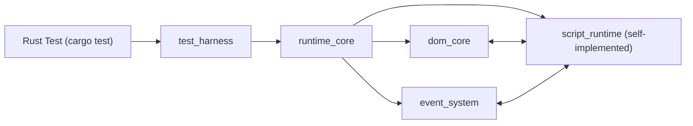

# Lightweight HTML+JS Test Runtime Design (Rust)

## 1. 背景と目的

`chromedp` のような実ブラウザ起動型E2Eは、起動・描画・ネットワーク・プロセス間通信のオーバーヘッドが大きく、フィードバックが遅くなりやすい。
本設計は、**単一HTMLファイル（インラインJSのみ）を対象**に、DOMとイベントの振る舞いだけを高速に検証するためのRust製テストランタイムを定義する。

主目的:
- フォーム入力、チェックボックス操作、ボタン押下、結果テキスト検証を高速に実行
- テストはRustのユニットテストとして実行可能
- 実ブラウザ互換を100%目指さず、対象業務に必要な範囲で安定実装する

## 2. スコープ

### 2.1 In Scope
- 1枚のHTML文字列を読み込み、DOMを構築
- インライン`<script>`実行
- DOM操作 (`querySelector`, `getElementById`, `textContent`, `value`, `checked`)
- イベントシステム (`click`, `input`, `change`, `submit`)
- キャプチャ/バブル、`preventDefault`, `stopPropagation`
- テストハーネスAPI（操作 + アサート）
- 失敗時の差分表示

### 2.2 Out of Scope
- 外部CSS/JSファイルの読み込み
- AJAX/fetch/XHR/WebSocket
- 画面描画、レイアウト計算、スタイル適用、アクセシビリティツリー
- iframe、shadow DOM、custom elements（MVPでは非対応）

## 3. 要件

### 3.1 機能要件
1. `Harness::from_html` でHTML初期化できる
2. `type_text`, `set_checked`, `click`, `submit` が呼べる
3. JSのイベントハンドラによりDOMが更新される
4. `assert_text`, `assert_value`, `assert_checked`, `assert_exists` ができる
5. 失敗時にセレクタ対象の実値と期待値を明示する

### 3.2 非機能要件
- 単体テスト1ケースあたり数ms〜数十msを目標（HTML規模依存）
- テスト間の完全独立（状態リーク防止）
- 決定論的な実行（時刻・乱数・非同期を固定可能）

## 4. 全体アーキテクチャ



モジュール:
- `dom_core`: DOM木、セレクタ、属性/プロパティ
- `script_runtime`: 自前パーサ + 自前評価器（JSサブセット）
- `event_system`: イベント伝播と既定動作
- `runtime_core`: 初期化、スクリプト実行、タスクキュー
- `test_harness`: 高水準のテスト操作API

## 5. クレート構成（採用方針）

- 本プロジェクトは**単一クレートで実装する**
- `src/lib.rs` を中心に、必要に応じて同一クレート内でモジュール分割する
- `runtime-core` / `dom-core` などの別クレート分割は行わない

## 6. DOMモデル詳細

### 6.1 データ構造
- Arena方式（`Vec<Node>`） + `NodeId(usize)`
- 各ノード:
  - `node_type`: Document / Element / Text
  - `parent: Option<NodeId>`
  - `children: Vec<NodeId>`
  - `tag_name`（Elementのみ）
  - `attributes: HashMap<String, String>`
  - `properties: ElementProperties`

`ElementProperties` (MVP):
- `value: String`（input/textarea/select）
- `checked: bool`（checkbox/radio）
- `disabled: bool`
- `selected_index: Option<usize>`（selectを見据えた拡張）

### 6.2 インデックス
- `id_index: HashMap<String, NodeId>`
- `class_index: HashMap<String, Vec<NodeId>>`（必要時）
- 先に `id` と単純セレクタ最適化のみ実装で十分

### 6.3 セレクタ
MVP対応:
- 単純/複合: `#id`, `.class`, `tag`, `[name]`, `[name=value]`,
  `tag#id.class[attr=value][attr2]`
- 結合子: 子孫（空白）, 子（`>`）, 隣接兄弟（`+`）, 後続兄弟（`~`）
- グループ: `A, B`（重複は除外し、文書順で返す）

非対応セレクタは明示的エラーにする（サイレント無視しない）。

## 7. スクリプトランタイム詳細

### 7.1 実装方式
- 外部JSエンジンは使わない（純Rustの自前実装）
- `<script>`文字列を自前パーサでASTへ変換し、自前評価器で実行
- 対応範囲はテスト用途に必要なJSサブセットへ限定し、非対応構文は`ScriptParse`で明示エラー

### 7.2 対応する構文/DOM API（最小）
- リスナー登録: `document.*.addEventListener(...)`
- 制御構文: `if/else`, 変数宣言, 代入, 三項演算子, 論理/比較演算子
- 数値リテラル: 整数（例: `1`）と小数（例: `0.5`）
- 算術演算子: `+`, `-`, `*`, `/`（単項マイナス対応。`+` は左結合で評価し、数値同士は加算・文字列が含まれる場合は連結）
- DOM参照: `getElementById`, `querySelector`, `querySelectorAll`, `querySelectorAll(...).length`,
  `form.elements.length`, `form.elements[index]`,
  `new FormData(form)`, `formData.get(name)`, `formData.has(name)`,
  `formData.getAll(name).length`
- DOM更新: `textContent`, `value`, `checked`, `className`, `id`, `name`, `classList.*`,
  `setAttribute/getAttribute/hasAttribute/removeAttribute`, `dataset.*`, `style.*`,
  `createElement/createTextNode`, `append/appendChild/prepend/removeChild/insertBefore/remove()`,
  `before/after/replaceWith`, `insertAdjacentElement/insertAdjacentText`, `innerHTML`
- タイマー: `setTimeout(callback, delayMs?)` / `setInterval(callback, delayMs?)`
  （timer ID返却。実時間待ちは行わず、`harness.advance_time(ms)` / `harness.flush()` で実行）,
  `clearTimeout(timerId)` / `clearInterval(timerId)`
- 時刻: `Date.now()`（fake clockの現在値 `now_ms` を返す）
- 乱数: `Math.random()`（決定論PRNGの浮動小数 `0.0 <= x < 1.0` を返す）
- イベント: `preventDefault`, `stopPropagation`, `stopImmediatePropagation`

`FormData` の簡易仕様（テスト用途）:
- `new FormData(form)` は `form.elements` を走査してスナップショットを作る
- 対象は `name` を持つ有効なコントロールのみ（`disabled` と `button/submit/reset/file/image` は除外）
- checkbox/radio は `checked=true` のものだけ対象、`value` が空なら `"on"` を使う
- `.get(name)` は最初の値を返し、存在しない場合は空文字
- `.has(name)` はキー存在判定を返す
- `.getAll(name).length` は同一キーの件数を返す
- `formData.append(name, value)` は末尾に値を追加する（`FormData` 変数に対するstatementのみ対応）
- `textarea` の初期値は要素本文テキストを使う
- `select` の初期値は `selected` 付き `option` を優先し、なければ先頭 `option` を使う
- `option` に `value` 属性がない場合、`option` のテキストを値として使う
- `select.value = x` 代入時は一致する `option` を1つ選択状態にし、他は非選択にする

### 7.3 Rust<->Scriptブリッジ
- ASTノード内の`DomQuery`/`DomProp`を介してDOMへアクセス
- イベント実行時は `EventState` とローカル変数環境 `env` を評価器へ渡す
- DOM更新時は必要に応じて`id_index`を同期する

## 8. イベントシステム詳細

### 8.1 Eventオブジェクト
フィールド:
- `type`, `target`, `currentTarget`, `bubbles`, `cancelable`, `defaultPrevented`
- 内部制御: `propagation_stopped`, `immediate_propagation_stopped`

### 8.2 伝播アルゴリズム
1. `target`からrootまでのpath構築
2. Captureフェーズ（root -> parent of target）
3. Targetフェーズ（target）
4. Bubbleフェーズ（parent of target -> root）

`stopPropagation` は以降フェーズ停止、`stopImmediatePropagation` は同一ノード残りリスナーも停止。

### 8.3 既定動作（重要）
`click` on checkbox:
1. `checked`トグル
2. `input`発火
3. `change`発火

`click` on submit button:
1. 祖先`form`の`submit`イベント発火
2. `preventDefault`されなければ成功扱い（遷移は実装しない）

## 9. Runtime実行モデル

### 9.1 初期化
1. HTML parse（自前HTMLパーサ）
2. DOM構築
3. `<script>`を文書順で同期実行
4. 初期タスクキュー実行

### 9.2 タスクキュー
- MVPは同期実行が基本
- 将来のため microtask風キューを保持
- タイマーは実時間を待たず、fake clock（初期値 `0ms`）で決定論的に実行する
- `harness.advance_time(ms)` で fake clock を進め、`due_at <= now` のタイマーのみ実行する
- `harness.run_due_timers()` で `now_ms` を進めずに、`due_at <= now_ms` のタイマーのみ実行する
- `harness.advance_time_to(targetMs)` で fake clock を絶対時刻へ進め、`due_at <= targetMs` のタイマーを実行する
- `harness.flush()` は fake clock を必要分だけ先送りして、キューが空になるまで実行する
- `harness.run_next_timer()` は次の1件だけ実行し、実行した場合 `true` を返す（空キューは `false`）
- `harness.run_next_due_timer()` は `due_at <= now_ms` の次の1件だけ実行し、実行した場合 `true` を返す
- `harness.clear_timer(timerId)` は指定timer IDを削除し、削除対象が存在した場合 `true` を返す
- `harness.clear_all_timers()` はキュー中タイマーを全削除し、削除件数を返す
- 安全上限は既定で `10000`（`harness.set_timer_step_limit(max_steps)` で変更可能）
- `harness.flush()` / `advance_time()` で安全上限超過時は、
  `now_ms`, `due_limit`, `pending_tasks`, `next_task` を含む診断付きエラーを返す
  （`due_limit` は `flush()` では `none`、`advance_time(ms)` では更新後の `now_ms`）
- `harness.pending_timers()` で現在キュー中のタイマー（`due_at`,`order` 昇順）を取得できる

### 9.3 決定論サポート
- `Date.now()` は fake clock（`now_ms`）を返す
- `now_ms` は `advance_time(ms)` / `flush()` によりのみ進む
- `Math.random()` は決定論PRNGで生成される
- `Harness::set_random_seed(seed)` で乱数列を再現可能にする

## 10. テストハーネスAPI詳細

```rust
pub struct Harness { /* runtime */ }

impl Harness {
    pub fn from_html(html: &str) -> Result<Self, Error>;

    // Action
    pub fn type_text(&mut self, selector: &str, text: &str) -> Result<()>;
    pub fn set_checked(&mut self, selector: &str, checked: bool) -> Result<()>;
    pub fn click(&mut self, selector: &str) -> Result<()>;
    pub fn submit(&mut self, selector: &str) -> Result<()>;
    pub fn dispatch(&mut self, selector: &str, event: &str) -> Result<()>;
    pub fn set_random_seed(&mut self, seed: u64);
    pub fn set_timer_step_limit(&mut self, max_steps: usize) -> Result<()>;
    pub fn now_ms(&self) -> i64;
    pub fn clear_timer(&mut self, timer_id: i64) -> bool;
    pub fn clear_all_timers(&mut self) -> usize;
    pub fn pending_timers(&self) -> Vec<PendingTimer>;
    pub fn run_due_timers(&mut self) -> Result<usize>;
    pub fn advance_time(&mut self, ms: i64) -> Result<()>;
    pub fn advance_time_to(&mut self, target_ms: i64) -> Result<()>;
    pub fn flush(&mut self) -> Result<()>;
    pub fn run_next_timer(&mut self) -> Result<bool>;
    pub fn run_next_due_timer(&mut self) -> Result<bool>;
    pub fn take_trace_logs(&mut self) -> Vec<String>;
    pub fn set_trace_stderr(&mut self, enabled: bool);
    pub fn set_trace_events(&mut self, enabled: bool);
    pub fn set_trace_timers(&mut self, enabled: bool);
    pub fn set_trace_log_limit(&mut self, max_entries: usize) -> Result<()>;

    // Assert
    pub fn assert_text(&self, selector: &str, expected: &str) -> Result<()>;
    pub fn assert_value(&self, selector: &str, expected: &str) -> Result<()>;
    pub fn assert_checked(&self, selector: &str, expected: bool) -> Result<()>;
    pub fn assert_exists(&self, selector: &str) -> Result<()>;
}
```

```rust
pub struct PendingTimer {
    pub id: i64,
    pub due_at: i64,
    pub order: i64,
    pub interval_ms: Option<i64>,
}
```

### 10.1 Actionの内部仕様
- `type_text`:
  - 対象`value`を置換
  - `input`イベント発火
- `set_checked`:
  - 既存値と異なるときのみ更新
  - `input` -> `change`
- `click`:
  - `click`イベント発火
  - 要素型に応じ既定動作実施

## 11. エラー設計

`Error`分類:
- `SelectorNotFound { selector }`
- `UnsupportedSelector { selector }`
- `TypeMismatch { selector, expected, actual }`
- `JsException { message, stack }`
- `AssertionFailed { selector, expected, actual, dom_snippet }`

失敗時は次を必ず含める:
- 対象セレクタ
- 期待値/実値
- 対象ノード周辺のHTML断片（最大N文字）

## 12. ログ・デバッグ

- `Harness::enable_trace(true)` でイベントトレース有効化
- トレースは標準エラーへ出力され、`take_trace_logs()` で取得してクリアできる
- `set_trace_stderr(false)` で標準エラー出力を止め、ログ収集のみを有効化できる
- `set_trace_events(false)` / `set_trace_timers(false)` でカテゴリ単位のログ出力を制御できる
- 保持件数は既定 `10000`。`set_trace_log_limit(n)` で変更でき、超過時は古いログから捨てる
- タイマー制御API実行時はサマリ行（advance/advance_to/run_due/flush）を出力する
- 出力例:
  - `[event] click target=#submit current=#submit phase=bubble default_prevented=false`
  - `[event] done submit target=#signup current=#signup outcome=completed default_prevented=false propagation_stopped=false immediate_stopped=false`
  - `[timer] schedule timeout id=1 due_at=10 delay_ms=10`
  - `[timer] run id=1 due_at=10 interval_ms=none now_ms=10`
  - `[timer] advance delta_ms=5 from=0 to=5 ran_due=1`
  - `[timer] flush from=5 to=10 ran=1`

- `dump_dom(selector)` で部分DOMを文字列化

## 13. テスト戦略

### 13.1 仕様テスト（ランタイム向け）
- イベント順序テスト
- `stopPropagation`挙動
- checkbox既定動作
- `preventDefault`時のsubmit抑止

### 13.2 利用者向けサンプルテスト
- 入力 + チェック + ボタン押下 + 結果文言確認
- バリデーション失敗時メッセージ確認

### 13.3 回帰テスト運用
- 過去バグは必ずfixture HTML化
- fixtureごとに期待スナップショット保有

## 14. 実装フェーズ

### Phase 1 (MVP)
- DOM基本操作
- `querySelector`最小対応
- インラインscript実行
- `click/input/change` + assert

### Phase 2
- `submit`、フォーム要素拡張
- エラー/差分表示強化
- トレースログ

### Phase 3
- セレクタ拡張
- microtaskの安定化
- 高速化（index、再利用）

## 15. 代表的ユースケース

```rust
#[test]
fn submit_updates_result() -> anyhow::Result<()> {
    let html = r#"
    <input id='name'>
    <input id='agree' type='checkbox'>
    <button id='submit'>Send</button>
    <p id='result'></p>
    <script>
      document.getElementById('submit').addEventListener('click', () => {
        const name = document.getElementById('name').value;
        const agree = document.getElementById('agree').checked;
        document.getElementById('result').textContent =
          agree ? `OK:${name}` : 'NG';
      });
    </script>
    "#;

    let mut h = Harness::from_html(html)?;
    h.type_text("#name", "Taro")?;
    h.set_checked("#agree", true)?;
    h.click("#submit")?;
    h.assert_text("#result", "OK:Taro")?;
    Ok(())
}
```

## 16. 技術選定

実装方針:
- HTML parse: 自前実装
- Selector: 自前実装
- Script runtime: 自前パーサ + 自前評価器
- Error: 独自 `Error` enum
- 外部依存は極小（現状は標準ライブラリ中心）

## 17. 既知リスクと対策

1. JS互換性不足（ES機能差）
- 対策: 対象HTMLのJS制約を定義し、非対応構文を早期エラー化

2. DOM仕様の実装漏れ
- 対策: 必須Web API一覧を契約化して段階実装

3. イベント順序のズレ
- 対策: 仕様テストを先に固定し、変更時にCIで検出

## 18. 受け入れ基準（DoD）

1. 単一HTML fixtureで主要ユースケースが3件以上通る
2. 失敗時ログにセレクタ・期待値・実値・DOM断片が出る
3. `cargo test`で安定再現（連続実行でflakyなし）
4. 新規fixture追加が容易（10分以内で1ケース追加可能）

---

この設計は、ブラウザ完全互換ではなく、**フォーム中心UIのロジック検証を最短で高速化するための実用設計**として定義している。

## 19. 低レベル実装設計

### 19.1 主要型定義（案）

```rust
#[derive(Clone, Copy, Debug, PartialEq, Eq, Hash)]
pub struct NodeId(pub usize);

#[derive(Debug)]
pub enum NodeType {
    Document,
    Element(ElementData),
    Text(String),
}

#[derive(Debug)]
pub struct ElementData {
    pub tag_name: String,
    pub attributes: std::collections::HashMap<String, String>,
    pub props: ElementProps,
}

#[derive(Debug, Default)]
pub struct ElementProps {
    pub value: String,
    pub checked: bool,
    pub disabled: bool,
}

#[derive(Debug)]
pub struct Node {
    pub parent: Option<NodeId>,
    pub children: Vec<NodeId>,
    pub node_type: NodeType,
}

#[derive(Debug, Default)]
pub struct Document {
    pub nodes: Vec<Node>,
    pub root: NodeId,
    pub id_index: std::collections::HashMap<String, NodeId>,
}
```

### 19.2 イベントリスナー保持構造

```rust
pub type ListenerId = u64;

pub struct ListenerEntry {
    pub id: ListenerId,
    pub event_type: String,
    pub use_capture: bool,
    pub callback: ScriptHandler,
}

pub struct ListenerStore {
    // node_id -> listeners
    pub map: std::collections::HashMap<NodeId, Vec<ListenerEntry>>,
    pub next_id: ListenerId,
}
```

要点:
- `removeEventListener` は `event_type + callback + use_capture` で一致削除
- dispatch中にリスナー配列が変更されても安全になるよう、実行対象はスナップショットを使う

### 19.3 ランタイム集約構造

```rust
pub struct Runtime {
    pub document: Document,
    pub listeners: ListenerStore,
    pub script: ScriptRuntime,
    pub task_queue: TaskQueue,
    pub trace: bool,
    pub trace_events: bool,
    pub trace_timers: bool,
    pub trace_logs: Vec<String>,
    pub trace_log_limit: usize,
    pub trace_to_stderr: bool,
}
```

`Harness` は `Runtime` をラップし、操作APIとアサートAPIを提供する。

## 20. HTMLロード仕様

1. 受け取ったHTML文字列をparse
2. `document` ノード作成
3. Element/Textを順にArenaへ格納
4. `id`属性を見つけた時点で `id_index` 登録（重複は後勝ちではなくエラー推奨）
5. `<script>`要素のテキストを文書順で収集
6. DOM構築完了後にscriptを同期実行

補足:
- script実行中のDOM変更（`appendChild/removeChild/insertBefore`等）は、DOM APIの整合性を優先し、
  `id_index`を都度更新する

## 21. スクリプト実行詳細

### 21.1 実行モデル
- `<script>`を文単位で解析してリスナー登録情報へ変換
- リスナー本文は `Stmt` / `Expr` のASTへ変換して保持
- イベント発火時に `execute_stmts` でASTを評価し、DOMへ副作用を反映

### 21.2 代表APIのRust側シグネチャ

```rust
fn parse_listener_registration(cursor: &mut Cursor<'_>) -> Result<ListenerRegistration>;
fn parse_block_statements(body: &str) -> Result<Vec<Stmt>>;
fn execute_stmts(
    &mut self,
    stmts: &[Stmt],
    event_param: &Option<String>,
    event: &mut EventState,
    env: &mut std::collections::HashMap<String, Value>,
) -> Result<()>;
```

### 21.3 例外方針
- 構文エラーは `ScriptParse`
- 実行時エラーは `ScriptRuntime`
- 失敗時はセレクタ・期待値/実値を返す（Assertion系）

## 22. イベント仕様の厳密化

### 22.1 `click(selector)` の動作順
1. 対象Element解決
2. `disabled=true` なら何もしない（ブラウザ挙動に合わせる）
3. `click` をdispatch
4. `defaultPrevented` が `false` の場合に既定動作
5. 既定動作により必要なら `input`/`change`/`submit` を追加dispatch
6. task queue flush（auto flush設定時）

### 22.2 `type_text(selector, text)` の動作順
1. 対象が `input`/`textarea` であることを検証
2. `value` を `text` に置換
3. `input` dispatch（`bubbles=true`）
4. `change` は呼ばない（`change`は明示イベントやblur相当時）

### 22.3 `set_checked(selector, checked)` の動作順
1. 対象がcheckbox/radioであることを検証
2. 値が変わる場合のみ更新
3. `input` dispatch
4. `change` dispatch

## 23. セレクタエンジン詳細

MVP実装案:
- 文字列を簡易パースして `SelectorAst` を作る
- 右から左へのマッチングで親探索
- 対応セレクタ: `#id`, `.class`, `タグ`, `[attr]`, `[attr='value']`, `*`, `:first-child`, `:last-child`, `:nth-child(n)`, 子孫/子/隣接/一般兄弟結合子
- `:nth-child(n)` は現時点では `1,2,3...` のみ受け付ける（0/負数/式系は未対応）
- 属性値比較は現在 `=` のみ対応

```rust
enum SelectorPseudoClass {
    FirstChild,
    LastChild,
    NthChild(usize),
}

struct SelectorStep {
    tag: Option<String>,
    universal: bool,
    id: Option<String>,
    classes: Vec<String>,
    attrs: Vec<SelectorAttrCondition>,
    pseudo_classes: Vec<SelectorPseudoClass>,
}

enum SelectorCombinator {
    Descendant,
    Child,
    AdjacentSibling,
    GeneralSibling,
}
```

性能:
- `#id` は `id_index` 直参照で O(1)
- それ以外は最悪 O(N) 走査

## 24. アサーション失敗フォーマット

```text
AssertionFailed: assert_text
  selector : #result
  expected : "OK:Taro"
  actual   : "NG"
  snippet  : <p id="result">NG</p>
```

設計方針:
- 1回の失敗で原因特定できる情報量を確保
- セレクタ未解決と値不一致は必ず区別

## 25. API契約テスト

最低限追加するべき契約テスト:
1. `querySelector("#id")` が先頭一致要素を返す
2. `addEventListener(capture=true)` がcapture順で呼ばれる
3. `stopPropagation` が親への伝播を止める
4. checkbox `click` で `checked` が反転する
5. `preventDefault` でsubmit既定動作が抑止される
6. `disabled` 要素の `click` が無視される

## 26. 実装順（タスク分解）

1. `dom_core`: Arena/Node/selector/id_index
2. `event_system`: listener登録とdispatch
3. `script_runtime`: parser/evaluator と `document`, `Element` 操作
4. `runtime_core`: parse -> build -> script実行
5. `test_harness`: action/assert API
6. 仕様テスト整備
7. エラー文言とtrace改善

## 27. 将来拡張ポイント

- `innerHTML` の仕様拡張（サニタイズ/DOMParser互換性の向上）
- タイマー相当の安全制御（`flush` ステップ上限や診断情報の改善）
- `radio` グループ排他
- `FormData` の追加メソッド（`append`, `getAll` など）

拡張時も「必要なユースケース起点でAPIを足す」方針を維持する。

## 28. 提案する最初のマイルストーン

2週間想定:
- Day 1-2: DOM + selector MVP
- Day 3-4: イベントdispatch MVP
- Day 5-6: script parser/evaluator（`getElementById`, `addEventListener`）
- Day 7-8: Harness action/assert
- Day 9-10: 契約テスト + 失敗表示改善

完了条件:
- サンプル3シナリオが `cargo test` で安定通過
- 主要APIでpanicなし、すべて `Result` 返却
