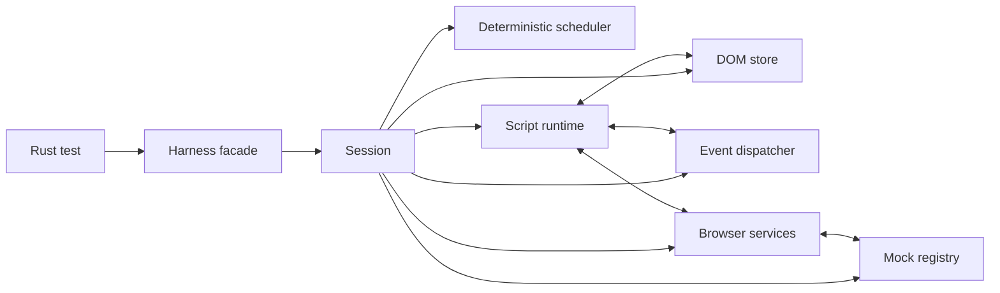

# browser-tester 振り返りと次回設計書

作成日: 2026-03-18

この文書は、現在の `browser-tester` を実装・運用してきた結果を踏まえて、

1. 何が良かったか
2. 何が重荷になったか
3. もし一から作り直すなら、どんな方針と設計にするか

を整理した次回向けの設計書である。

---

## 1. 現状観測

2026-03-18 時点で、リポジトリから読み取れる現状は次の通り。

- 本体は Rust 製の単一公開クレート `browser_tester`
- `src` 配下の本番コードは 150 ファイル、約 125,881 行
- `src/tests` は 262 ファイル、約 92,987 行
- `tests` 配下の統合テストは 39 ファイル、約 10,084 行
- `README.md` は 1,160 行で、利用方法と設計書の両方を抱えている
- `Harness` を中心に API を提供している
- HTML パーサ、DOM、セレクタ、イベント、JS 風ランタイム、各種 Web API 風挙動を自前で持つ
- 最近の変更は、実運用バグの再現テストを追加してから局所修正する流れが多い

構造的に見ると、このパッケージは「軽いブラウザテスト用ハーネス」から始まりつつ、今は「決定論を重視した独自ブラウザ風ランタイム」にかなり近い位置まで広がっている。

この広がり自体は成果でもあるが、同時に次の段階では設計方針を明確にしないと保守コストが急増する状態でもある。

---

## 2. 良かった点

## 2.1 プロダクトの芯が明確だった

一番良かったのは、最初から「本物のブラウザを起動しない」「単一プロセス」「決定論的」「Rust のテストから直接使える」という芯が明確だったことだと思う。

この芯があったため、機能追加の判断がぶれにくかった。
例えば以下は全部この軸に沿っている。

- fake clock による時間制御
- `Math.random()` の固定化
- `fetch` / `clipboard` / `location` / `file input` のモック注入
- `window.print()` や download の観測
- `eval` 非対応による制御容易性

「何でもできるブラウザ」ではなく、「テストに必要な範囲を決定論で再現する」という立ち位置は正しかった。

## 2.2 `Harness` 中心の公開 API は分かりやすい

利用者視点では `Harness::from_html(...)` から始まり、

- `click`
- `type_text`
- `set_checked`
- `dispatch`
- `advance_time`
- `assert_text`

といった操作で閉じている。

これは非常に強い。

内部がどれだけ複雑でも、入口が単純なので「テスト用パッケージ」としての体験は崩れにくい。
この方針は次回も維持すべきである。

## 2.3 モックを中核機能として扱ったのは正解だった

`fetch` や `location` をあと付けで無理やり差し替えるのではなく、最初からテスト用にモック可能な構造として育てたのは正解だった。

特に良い点は次の通り。

- API モックが「裏技」ではなく公開機能になっている
- call capture と artifact capture を両立している
- 失敗系も注入できる
- ファイル入力や clipboard のような人手依存箇所も deterministic にできている

テスト基盤としては、ブラウザ互換性そのものよりも、こうした制御可能性の方が価値が高い。

## 2.4 回帰テスト駆動の運用が機能していた

最近の履歴を見ると、

- 実案件や issue 由来の不具合を縮小再現
- テストとして固定
- 局所修正
- リリース

という流れがきちんと回っている。

これはかなり重要で、仕様準拠の理想論よりも、利用者の壊れ方に向き合うプロダクトとして健全である。

また、property test を CI に組み込んでいる点も良い。
通常の回帰テストだけでは拾いにくいパーサやランタイムの境界バグを拾う設計になっている。

## 2.5 単一公開クレートで配布しやすかった

利用者が `cargo add browser_tester` してすぐ使えるのは大きい。
外部ブラウザ、Node.js、WebDriver を要求しないのも導入障壁を下げている。

「テスト支援ライブラリは導入の軽さが重要」という意味で、この判断は正しかった。

## 2.6 ドメイン知識がリポジトリに蓄積された

HTML 標準、DOM、イベント順序、フォーム、History API、Clipboard、File、Canvas などの知見が、実装とテストの両方に蓄積されている。

これは単なるコード量ではなく、判断履歴の資産である。
次回設計でも、この知見は必ず再利用すべきである。

---

## 3. 反省点

## 3.1 自前実装そのものではなく、その制御が足りなかった

最大の反省点はこれである。

現行版は次をかなり自前で持っている。

- HTML パース
- DOM
- セレクタ
- JS 構文解析
- JS 実行
- イベント伝播
- 各種 Web API 風オブジェクト

ここでの反省は、「自前実装をしたことが間違いだった」という意味ではない。
むしろ、テスト用途に合わせて挙動を細かく制御するには、自前実装の価値は大きい。

本当に問題だったのは、

- 自前実装の範囲が広い
- 公開 surface も広がる
- その一方で subsystem 境界と support policy が後追いになる

という組み合わせだった。

この構成は初期には機動力があるが、時間が経つほど「1 個のバグが 4 層に波及する」状態になる。

とくに JS 実行系を自前で持つと、

- クロージャ
- lexical binding
- callback capture
- async/microtask
- receiver validation
- built-in object semantics

のような、DOM テストとは直接関係ないが避けて通れない問題が大量に発生する。

結果として「ブラウザテストパッケージ」を作っているつもりが、「JavaScript エンジンに近いもの」を同時に育てることになった。

これはコストが非常に高い。

したがって次回の教訓は、

- 自前実装を避けること

ではなく、

- 自前実装を前提に、対象範囲、層分離、公開契約を最初から厳格に管理すること

である。

## 3.2 `Harness` は使いやすいが、内部では責務が集中しすぎた

公開 API としての `Harness` は良いが、内部実装では `impl Harness` が多数のファイルに分散し、結果として「便利な facade」ではなく「何でも知っている神オブジェクト」に近づいた。

観測上も、`impl Harness` は非常に多く、巨大ファイルも複数ある。

これは次の問題を生む。

- 責務境界が曖昧になる
- どこに手を入れるべきか分かりにくい
- 新機能を足すたびに既存副作用を踏みやすい
- 巨大ファイルに修正が集中する

次回は `Harness` を公開 facade に限定し、内部状態と機能は subsystem ごとに明確に分離すべきである。

## 3.3 README に利用方法と設計書を同居させたのは重かった

`README.md` は 1,160 行あり、利用方法、モック説明、詳細設計、低レベル設計が混在している。

これは次の点でよくない。

- 初めて使う人が必要情報に早く辿り着けない
- 実装変更時に README 全体の同期コストが高い
- 設計書の更新が README 改訂と結びつき、更新が億劫になる
- 「README にあるが実ファイルがない」ような運用ずれが起きやすい

次回は文書を明確に分けるべきである。

- README: 利用開始、最小 API、主要モック、制約
- architecture doc: 設計思想と全体像
- capability matrix: 何を保証して何を保証しないか
- mock guide: モックの使い方
- ADR: 重要な設計判断の履歴

## 3.4 スコープ管理が難しくなった

本来の価値は「テストで困るところを deterministic にする」ことだったが、仕様準拠を積み上げる過程で公開 surface が大きくなった。

その結果、次の緊張関係が強くなった。

- 軽量テストハーネスでありたい
- でも exposed API は増えている
- 互換性は高めたい
- でも全部を保証すると保守不能になる

つまり、「製品としてどこまで約束するか」の線引きが、後になるほど難しくなった。

次回は最初から capability ごとに公開契約を定義し、安定版と実験版を分けるべきである。

## 3.5 テストは厚いが、厚さ自体が保守負荷にもなった

現行版のテスト資産は強みだが、巨大テストファイルや issue 単位の回帰テスト蓄積により、次の課題もある。

- 似た種類の失敗が複数箇所に分散する
- どのテストがプロダクト契約で、どれが内部偶然を固定しているのか曖昧になる
- テストの粒度が不揃いで、修正時の影響把握が難しい

次回はテストを次の 4 層に分けるべきである。

- public contract tests
- subsystem tests
- regression tests
- fuzz/property tests

この層分けがないと、テストが多いほど判断が難しくなる。

## 3.6 「できること」が広くなりすぎて、次に足すべきものが見えづらくなった

現行版はすでに多くの API を公開している。
これは成果だが、同時に「どこから先は別製品か」が見えづらい。

次回は以下を明文化する必要がある。

- これは core capability
- これは test-only facade
- これは convenience mock
- これは experimental

これを明文化しない限り、利用者の期待と実装コストの釣り合いが取りにくい。

---

## 4. もし一から作るならの結論

一から作るなら、次の方針を採る。

1. コア機能は可能な限り既存実装に依存せず、自前実装する
2. 自前実装の対象は、HTML パース、DOM、セレクタ、Script runtime、イベント、URL/Location モデル、決定論スケジューラ、モック、公開ハーネスまで含める
3. その代わり、最初から対象範囲を強く絞る
4. 公開 API は小さく保つ
5. 内部は workspace で分割し、境界を強制する
6. capability matrix を最初に定義する
7. README は短く、詳細設計は別文書に分ける
8. mock は第一級機能として設計する
9. 機能追加より先に「どの層に置くか」を決める
10. 不具合修正は引き続き regression-first で進める

短く言えば、次回は

「なるべく多くを自前実装する」前提を維持しつつ、
「対象範囲を意図的に絞った deterministic runtime を、層分離を先に決めて作る」

方向に寄せる。

---

## 5. 次回アーキテクチャの基本方針

## 5.1 目標

次回版の目標は以下である。

- Rust のテストから、単一プロセスで、DOM を伴うブラウザ風操作を deterministic に実行できる
- 本物のブラウザを起動しなくても、フォーム中心の UI ロジックを高速に検証できる
- モックを簡単に差し込める
- 公開 API は単純だが、内部は保守しやすい

## 5.2 非目標

最初からやらないものを明示する。

- 画面レンダリング
- CSS layout engine
- 外部ネットワーク I/O
- service worker
- broad media loading
- iframe の完全再現
- 任意 Web API の網羅
- full browser compatibility

「できないものをはっきり書く」ことを、設計の一部にする。

## 5.3 設計原則

- Principle 1: 決定論は仕様であり、オプションではない
- Principle 2: コア機能は原則として自前実装する
- Principle 3: 自前実装の範囲を広げる代わりに、対象 surface を厳格に制限する
- Principle 4: capability 単位で責務を切る
- Principle 5: すべての公開機能に docs と tests を紐づける
- Principle 6: mock は escape hatch ではなく正式 API にする
- Principle 7: surface を広げる前に support policy を書く

---

## 6. 想定技術方針

次回は以下のような実装方針を採る。

- HTML parsing: 独自 parser + tree builder を持つ
- URL resolution/parsing: 対象範囲を絞った独自 URL/Location モデルを持つ
- Script runtime: 独自 lexer / parser / evaluator を持つ
- DOM / event / scheduler / mocks / harness facade: 自前実装
- 外部依存は補助用途に限定する

### 6.1 前提条件

この次回設計では、次を明示的な前提にする。

- 既存実装はできるだけ使わない
- なるべくすべての機能を自前実装する
- ただし、補助的なデータ構造、数値型、Unicode などの低レベル補助は必要最小限の依存を許容する

つまり、依存を避ける対象は「動作の中核を決める実装」である。

具体的には、次は外部実装に寄せない。

- HTML パーサ本体
- URL 解決本体
- Script 言語処理本体
- DOM / Event / Navigation の挙動本体

### 6.2 この前提を置く理由

理由は次の通り。

- 挙動の制御権を完全に握れる
- テスト用途に都合のよい簡約モデルを作りやすい
- どこまで対応するかを自分たちで決められる
- deterministic contract を守りやすい
- 外部実装の仕様変更に設計を引きずられにくい

### 6.3 この前提で必須になる抑制

自前実装前提にする以上、代わりに次を厳守する。

- 対象機能を増やしすぎない
- 互換性の対象を先に文書化する
- subsystem を混ぜない
- 巨大ファイル化を防ぐ
- regression-first を崩さない

### 6.4 Script runtime に依存しすぎないための条件

- DOM の真の状態は Rust 側だけに持つ
- Script object は opaque handle を保持するだけにする
- host binding は capability ごとに分ける
- script runtime 固有の型をドメイン層に漏らさない
- parser / evaluator / binding を別モジュールに分ける

---

## 7. 全体アーキテクチャ



重要なのは、`Harness` 自体を巨大化させないことだ。

- `Harness`: 利用者向け facade
- `Session`: 実行状態の集約
- subsystem: 明確な責務単位

---

## 8. ワークスペース構成

次回は単一公開クレートを維持しつつ、内部は workspace 分割する。

### 8.1 構成

```text
crates/
  browser-tester/          # 公開 facade
  bt-dom/                  # HTML parser, DOM, selector subset
  bt-runtime/              # event, scheduler, services, mocks
  bt-script/               # lexer, parser, evaluator, host binding
docs/
  architecture.md
  capability-matrix.md
  mock-guide.md
  limitations.md
  adr/
```

### 8.2 この構成にする理由

- 境界をコードで強制できる
- 巨大ファイル化を防ぎやすい
- unit test を subsystem 単位で持てる
- script runtime と DOM/runtime の責務を分離できる
- 公開 API の見通しが良くなる

---

## 9. データモデル設計

## 9.1 Node 識別子

`NodeId(usize)` のような生の index ではなく、世代付き ID を使う。

候補は独自 generational key を第一候補とする。
この層もなるべく自前で制御する。

これにより、削除済みノード参照や stale handle の誤用を減らす。

## 9.2 DOM 保持構造

```rust
pub struct DomStore {
    nodes: NodeArena,
    document: DocumentState,
    indexes: DomIndexes,
    side_tables: DomSideTables,
}

pub struct NodeRecord {
    parent: Option<NodeId>,
    children: Vec<NodeId>,
    kind: NodeKind,
}

pub enum NodeKind {
    Document,
    Element(ElementData),
    Text(TextData),
    Comment(String),
}
```

## 9.3 side table 方針

現行版のように element の状態を一つの大きな構造体に寄せるのではなく、能力ごとに side table を分ける。

例:

- `form_controls: SecondaryMap<NodeId, FormControlState>`
- `selection: SecondaryMap<NodeId, SelectionState>`
- `dialogs: SecondaryMap<NodeId, DialogState>`
- `media: SecondaryMap<NodeId, MediaState>`
- `layout_stub: SecondaryMap<NodeId, LayoutStubState>`

この方針にすると、要素状態が無制限に膨らみにくい。

## 9.4 インデックス

最初から次のインデックスを持つ。

- `id_index`
- `name_index`
- `tag_index`
- 必要最小限の class index

ただし index 更新は DOM mutation API の責務として一元化する。
勝手に各所で直さない。

---

## 10. セレクタ方針

次回は「最初から CSS を広く再現する」のではなく、テスト価値の高い subset を保証する。

### 10.1 v1 で保証する範囲

- `#id`
- `.class`
- `tag`
- `[attr]`
- `[attr=value]`
- descendant combinator
- child combinator
- `:checked`
- `:disabled`
- `:enabled`
- `:first-child`
- `:last-child`
- `:nth-child(n)`
- `:not(...)`
- `:is(...)`

### 10.2 やらないこと

- CSS4 全面対応を初期目標にしない
- 複雑な pseudo class の拡張は backlog 化する
- silent ignore はしない

未対応セレクタは必ず明示エラーにする。

### 10.3 理由

テストハーネスで多いのは単純セレクタである。
ここで最初から全面対応を狙うと、セレクタ実装自体が主戦場になってしまう。

---

## 11. Script runtime 設計

## 11.1 中心インターフェース

```rust
pub struct ScriptRuntime {
    parser: ScriptParser,
    evaluator: Evaluator,
    heap: ScriptHeap,
    globals: GlobalEnvironment,
}

impl ScriptRuntime {
    pub fn eval_program(
        &mut self,
        code: &str,
        source_name: &str,
        host: &mut HostBindings,
    ) -> Result<(), ScriptError>;

    pub fn run_microtasks(
        &mut self,
        host: &mut HostBindings,
    ) -> Result<(), ScriptError>;
}
```

## 11.2 バインディングの原則

- `Window`, `Document`, `Element`, `Event`, `Location`, `History` などは host object とする
- Script 側の object identity は bridge 層で管理する
- 実体データは Rust 側の `Session` が持つ
- Script 側から DOM を触るときは、必ず capability service を経由する

## 11.3 binding module の分割

次のように family ごとに分ける。

- `bindings/window.rs`
- `bindings/document.rs`
- `bindings/element.rs`
- `bindings/events.rs`
- `bindings/forms.rs`
- `bindings/location.rs`
- `bindings/history.rs`
- `bindings/storage.rs`
- `bindings/fetch.rs`

一つの巨大 helper ファイルに集約しない。

## 11.4 守るべきルール

- script runtime 固有 API を DOM 層に持ち込まない
- binding 実装から直接 DOM 内部構造を書き換えない
- callback 実行は event/scheduler の制御下で行う
- binding の追加時は public contract test と mock guide 更新を必須にする

---

## 12. イベントシステム設計

## 12.1 要件

- capture / target / bubble
- `preventDefault`
- `stopPropagation`
- `stopImmediatePropagation`
- trusted event と synthetic event の区別
- default action registry

## 12.2 default action の実装方針

default action は event dispatch 本体に埋め込まず、registry 方式にする。

```rust
pub trait DefaultAction {
    fn applies(&self, target: NodeId, event: &EventInstance, dom: &DomStore) -> bool;
    fn run(&self, session: &mut Session, target: NodeId, event: &EventInstance) -> Result<()>;
}
```

例:

- checkbox click
- radio click
- submit button click
- anchor click
- label click forwarding
- file input activation

この方式なら、イベント系のバグと要素固有の default action を分離できる。

---

## 13. Scheduler と決定論設計

## 13.1 必須要件

- fake clock
- timer queue
- microtask queue
- `advance_time`
- `advance_time_to`
- `run_due_timers`
- `flush`
- 安全ステップ上限

## 13.2 実装方針

```rust
pub struct Scheduler {
    now_ms: i64,
    timers: BinaryHeap<ScheduledTimer>,
    microtasks: VecDeque<Microtask>,
    next_timer_id: u64,
    step_limit: usize,
}
```

優先順位:

1. 現在 task の終了
2. microtask drain
3. due timer 実行
4. timer 内 callback の後に microtask drain

## 13.3 乱数

乱数は scheduler から独立した deterministic PRNG service とする。
`set_random_seed` は service の seed を変えるだけにする。

---

## 14. Mock 設計

mock は次回も中核機能として扱う。

## 14.1 mock family

- fetch
- location/navigation
- dialogs (`alert` / `confirm` / `prompt`)
- clipboard
- downloads
- localStorage/sessionStorage seed
- file input
- matchMedia

## 14.2 API 設計

`Harness` に `set_*` を大量に生やし続けるのではなく、typed registry を返す。

```rust
let mut h = Harness::builder().html(html).build()?;
h.mocks_mut().fetch().respond_text("https://app.local/api", 200, "ok");
h.mocks_mut().dialogs().confirm().push(true);
```

## 14.3 capture と inspection

各 mock family は以下を持つ。

- response injection
- error injection
- call capture
- artifact capture
- reset

## 14.4 ドキュメントルール

新しいテスト用 mock を公開したら、必ず `README.md` と `docs/mock-guide.md` に最小使用例を書く。

これは次回の運用ルールとして固定する。

---

## 15. Browser services 設計

Script 側の API 実装は、直接 `Session` をいじるのではなく service trait を叩く。

```rust
pub trait FetchService {
    fn fetch(&mut self, req: FetchRequest) -> Result<FetchResponse>;
}

pub trait ClipboardService {
    fn read_text(&mut self) -> Result<String>;
    fn write_text(&mut self, value: &str) -> Result<()>;
}
```

`MockRegistry` はこれら service の test 実装を持つ。

この形にすると、

- JS binding
- mock 実装
- contract test

の境界が明確になる。

---

## 16. 公開 API 設計

## 16.1 基本 API

```rust
let mut h = Harness::builder()
    .url("https://app.local/")
    .html(html)
    .local_storage([("token", "abc")])
    .build()?;

h.type_text("#name", "Alice")?;
h.click("#submit")?;
h.assert_text("#result", "Hello, Alice")?;
```

## 16.2 想定 API

```rust
pub struct Harness;
pub struct HarnessBuilder;

impl Harness {
    pub fn builder() -> HarnessBuilder;

    pub fn click(&mut self, selector: &str) -> Result<()>;
    pub fn type_text(&mut self, selector: &str, text: &str) -> Result<()>;
    pub fn set_checked(&mut self, selector: &str, checked: bool) -> Result<()>;
    pub fn set_select_value(&mut self, selector: &str, value: &str) -> Result<()>;
    pub fn focus(&mut self, selector: &str) -> Result<()>;
    pub fn blur(&mut self, selector: &str) -> Result<()>;
    pub fn dispatch(&mut self, selector: &str, event: &str) -> Result<()>;
    pub fn advance_time(&mut self, ms: i64) -> Result<()>;
    pub fn flush(&mut self) -> Result<()>;

    pub fn assert_text(&self, selector: &str, expected: &str) -> Result<()>;
    pub fn assert_value(&self, selector: &str, expected: &str) -> Result<()>;
    pub fn assert_checked(&self, selector: &str, expected: bool) -> Result<()>;
    pub fn assert_exists(&self, selector: &str) -> Result<()>;

    pub fn mocks_mut(&mut self) -> MockRegistryView<'_>;
    pub fn debug(&self) -> DebugView<'_>;
}
```

## 16.3 API 設計上のルール

- よく使う操作だけを `Harness` 直下に置く
- 高度な設定は subview に逃がす
- `set_*` / `take_*` を無限増殖させない
- 返り値は test で扱いやすい plain struct にする

---

## 17. Error 設計

エラーは最初から分類する。

```rust
pub enum Error {
    HtmlParse(HtmlParseError),
    JsSetup(JsSetupError),
    Script(ScriptError),
    Selector(SelectorError),
    Dom(DomError),
    Event(EventError),
    Timer(TimerError),
    Mock(MockError),
    Assertion(AssertionError),
}
```

Assertion 系は必ず次を含む。

- selector
- expected
- actual
- DOM snippet
- 可能なら last event trace

---

## 18. Capability Matrix

次回は最初から capability matrix を持つ。

### 18.1 区分

- Stable Core
- Stable Test Mocks
- Experimental Browser Facades
- Internal Only

### 18.2 例

- Stable Core:
  - DOM construction
  - selector subset
  - form interaction
  - event dispatch
  - timer control
  - basic assertions
- Stable Test Mocks:
  - fetch mock
  - clipboard mock
  - location mock
  - file input mock
- Experimental Browser Facades:
  - limited navigation model
  - canvas artifact helpers
  - media-lite state

これにより、どこまでの後方互換を約束するかが明確になる。

---

## 19. テスト戦略

## 19.1 public contract tests

利用者が依存してよい振る舞いを固定するテスト。

例:

- `click` の基本順序
- `type_text` の反映
- `submit` の validation / cancel 挙動
- mock API の使用例

## 19.2 subsystem tests

DOM、selector、event、scheduler、mock family 単位のテスト。

## 19.3 regression tests

実バグの縮小再現。
1 issue 1 reduced fixture を原則にする。

## 19.4 property / fuzz tests

- selector parser
- scheduler ordering
- DOM mutation invariant
- event dispatch invariant

## 19.5 browser comparison tests

ここは最小限にする。
公開 contract に関係するものだけを比較対象にする。

「比較できるから全部比較する」はやらない。

---

## 20. 文書戦略

## 20.1 README の責務

README は次だけを書く。

- 何のためのパッケージか
- 30 秒で始める最小例
- 主な制約
- 主な mock の入口
- 詳細設計へのリンク

200 から 250 行程度に抑える。

## 20.2 別文書

- `docs/architecture.md`
- `docs/capability-matrix.md`
- `docs/mock-guide.md`
- `docs/limitations.md`
- `docs/adr/*.md`

## 20.3 ADR を残すべき判断

- script runtime の文法範囲
- selector subset 方針
- navigation model の限定範囲
- mock family の公開可否
- capability の stable 化

---

## 21. 開発ルール

次回は設計崩壊を防ぐため、次のルールを導入する。

- 1 ファイルが 800 行を超えたら分割を検討する
- 1 機能追加につき、所属 subsystem を先に決める
- public API を増やすときは capability matrix 更新必須
- mock family を増やすときは README と mock guide 更新必須
- regression test のない修正は原則マージしない
- Script binding から DOM 内部構造へ直接書き込まない
- script runtime 固有型を subsystem 外へ出さない

---

## 22. 段階的実装計画

## Phase 0: Skeleton

- workspace 作成
- `HarnessBuilder`
- `Session`
- `DomStore`
- error taxonomy
- 文書ひな形

完了条件:

- HTML なしの空 session を作れる
- docs と test skeleton がある

## Phase 1: DOM Core

- 独自 HTML parser
- DOM tree 構築
- selector subset
- `assert_exists`
- `dump_dom`

完了条件:

- HTML 文字列から DOM 構築
- `#id` / tag / attr セレクタで select できる

## Phase 2: Script Runtime

- lexer
- parser
- evaluator
- `window` / `document` / `Element` binding
- inline script 実行

完了条件:

- `getElementById(...).textContent = ...` が動く
- simple event handler を登録できる

## Phase 3: Events + Forms

- event dispatch
- default action registry
- form controls
- `click`, `type_text`, `set_checked`, `submit`

完了条件:

- 典型的な form UI テストが通る

## Phase 4: Determinism + Mocks

- fake clock
- microtasks
- fetch mock
- dialogs
- clipboard
- location mock
- file input mock

完了条件:

- モック前提の現実的なテストを書ける

## Phase 5: Hardening

- regression suite
- property tests
- contract tests
- docs polish
- publish checklist

完了条件:

- README と docs が一致
- quick CI と nightly hardening が回る

注記:

- この workspace では Phase 0 から Phase 6 まで完了済み
- Phase 7 を script DOM query expansion として設計済み、実装はこれから

## Phase 6: Selector Expansion

目的:

- Phase 1 subset を超える selector を、既存 `Harness` API から deterministic に使えるようにする
- 既存の action / assertion / debug path が同じ selector resolver を使い続けられるようにする

担当:

- `bt-dom` が selector parsing / matching / indexes を所有する
- `browser-tester` は public contract と regression だけを持つ

スライス:

1. class selectors and compound simple selectors（完了）
   - `.class`, `tag.class`, `#id.class`
   - tests: `DomStore::select`, `assert_exists`, action resolution
2. descendant combinators（完了）
   - `A B`
   - tests: nested DOM matching and document-order behavior
3. child combinators（完了）
   - `A > B`
   - tests: direct-child matching and false-positive avoidance
4. selector hardening（完了）
   - unsupported selector syntax remains explicit
   - tests: `click`, `type_text`, `set_checked`, `set_select_value`, `focus`, `blur`, `submit`, and `dispatch` continue to resolve selectors deterministically
   - keep quick / hardening profiles green

完了条件:

- `.class`, descendant, and child selectors work through `DomStore::select`
- `Harness` assertions and actions can resolve them without new public API
- unsupported syntax still fails explicitly
- docs, contract tests, and regression tests agree

## Phase 7: Script DOM Query Expansion

目的:

- inline script と event handler から `getElementById` 以外の bounded selector lookup を使えるようにする
- script 側の DOM アクセスを `bt-dom` の selector engine と共有しつつ、`Harness` の public API を増やさない

担当:

- `bt-script` が `Document` / `Element` の method dispatch と return value wrapping を所有する
- `bt-runtime` が host binding を通じて `DomStore` の selector 解決を提供する
- `bt-dom` は selector parsing / matching / subtree traversal の所有を維持する

スライス:

1. `document.querySelector(selector)` と `element.querySelector(selector)`（予定）
   - document order の first match を返す
   - miss は `null`
   - scoped lookup は subtree に限定する
2. `Element.matches(selector)`（予定）
   - current element だけを判定する
   - return は boolean
3. `Element.closest(selector)`（予定）
   - self を含む ancestor walk
   - miss は `null`
4. selector hardening and regression coverage（予定）
   - unsupported selector syntax remains explicit
   - `querySelectorAll` / NodeList / broader CSS parsing are out of scope for this phase

完了条件:

- inline scripts and listeners can use selector-based lookup without a new public `Harness` method
- missing matches are `null`, not hard errors
- selector grammar stays bounded and deterministic
- unsupported syntax continues to fail explicitly
- docs, contract tests, and regression tests agree

## Phase 6 以後の進め方

運用ルール:

1. まず 1 つの user-visible gap または regression cluster を選ぶ
2. owning subsystem を先に決める
3. public contract test / subsystem test / failure-path test を先に決める
4. 実装は owning subsystem に閉じる
5. 既存 API で足りない場合だけ `Harness` に公開する
6. 公開面が変わる変更では README / capability matrix / mock guide も同じ変更で更新する

新しい named phase を切る条件:

- 複数の今後の slice が 1 つの cross-cutting milestone に収束している
- その milestone に独立した完了条件が必要

それまでは、Phase 6 後モードとして backlog 駆動の小さい slice を継続する。

---

## 23. 採用しない案

## 23.1 既存ブラウザ互換を全面目標にして、無制限に全部を自前で広げ続ける案

不採用。

理由:

- 保守範囲が広すぎる
- 本来のテスト用途を超えて互換性競争になる
- Script 言語互換性そのものが主戦場になってしまう

## 23.2 最初から本物のブラウザを埋め込む案

不採用。

理由:

- 起動が重い
- 決定論を作りにくい
- テスト向けモックを統一しづらい

## 23.3 README に全部書く案

不採用。

理由:

- 利用者向け導線が悪化する
- 設計の更新コストが高い
- 同期ずれが起きやすい

---

## 24. 最終方針

現行版から得た最大の教訓は次の 2 つである。

1. `Harness` 中心の deterministic test runtime という製品方針は正しい
2. HTML/JS/DOM を広範囲に自前実装するなら、対象範囲と層分離を先に固定しないと重すぎる

したがって次回は、

- 製品の芯は維持する
- 重い部分も独自実装前提で扱う
- その代わり対象範囲と層分離を先に固定する
- 自前で持つ範囲を capability 単位で管理する
- capability と文書の運用を先に決める

という方針で進める。

この方針なら、現行版で積み上げた知見を捨てずに、
より小さいコストで、より長く保守できるブラウザテスト用パッケージに作り直せる。
