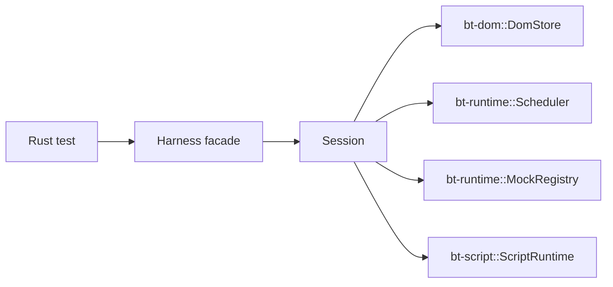

# Architecture

## Intent

`next/` is a clean-room rewrite workspace for the next generation of `browser-tester`.

The design is derived from [`next.md`](../../next.md) and keeps four constraints fixed from the start:

- deterministic execution is a product contract
- the public surface stays centered on `Harness`
- implementation ownership is enforced by workspace boundaries
- mocks are first-class test APIs, not ad hoc escape hatches

## Goals

- Run browser-style tests in a single Rust process.
- Keep time, randomness, and browser-like APIs deterministic.
- Support form-heavy UI tests without launching a real browser.
- Make subsystem ownership visible in code and docs before feature growth starts.

## Non-Goals

- real rendering or layout
- general-purpose network I/O
- service workers
- full iframe semantics
- full browser compatibility
- broad Web API coverage without an explicit capability decision

## Workspace Layout

```text
next/
  crates/
    browser-tester/   # public facade crate
    bt-dom/           # DOM store, HTML parser, selector subset
    bt-runtime/       # session, scheduler, services, mocks, debug state
    bt-script/        # lexer, parser, evaluator, host bindings
  doc/
```

Current implementation status:

- `browser-tester-next` exposes `Harness`, `HarnessBuilder`, the planned error taxonomy, `assert_exists`, and the debug DOM dump view
- `bt-dom` owns `DomStore`, generational `NodeId`, tree construction, selector subset support, indexes, and side-table skeletons
- `bt-runtime` owns `Session`, scheduler, deterministic mock registry, and debug state
- `bt-script` owns `ScriptRuntime`, the host-binding seam, and script-visible collection wrappers such as `NodeList` and minimal `HTMLCollection`

## High-Level Runtime Shape



`Harness` is intentionally thin.
State lives in `Session`, and subsystem crates own their internal data.

## Data Ownership Rules

- DOM truth lives in `bt-dom`.
- Scheduler truth lives in `bt-runtime`.
- Script-runtime internals stay inside `bt-script`.
- Browser-like service behavior is modeled in `bt-runtime` and consumed through bindings later.
- Public `Harness` methods delegate inward and should not accumulate long-lived state.

## Phase Plan

### Phase 0

- workspace skeleton
- `HarnessBuilder`
- `Session`
- `DomStore`
- scheduler and mock registry skeleton
- error taxonomy
- design docs

### Phase 1

- HTML parser and tree builder
- selector subset
- `assert_exists`
- DOM dump helpers

### Phase 2

- script lexer, parser, evaluator
- `window`, `document`, and `Element` bindings
- inline script bootstrapping

### Phase 3

- event dispatch with ancestor bubbling and capture listeners
- cancelable default actions
- form controls, including select state
- user-facing `Harness` actions

### Phase 4

- fake clock hardening
- microtask semantics
- fetch, clipboard, dialog, location, and file-input mocks
- download capture

### Phase 5

- contract tests
- regression suite
- property tests
- publication checklist

### Phase 6

- selector expansion
- class selectors and compound simple selectors
- descendant combinators
- child combinators
- selector hardening
- quick and hardening test profiles

### Phase 7

- script DOM query expansion
- `document.querySelector`
- `element.querySelector`
- `Element.matches`
- `Element.closest`
- `querySelectorAll` and minimal `NodeList` support in a post-Phase-7 collection slice
- `Element.children`, `getElementsByTagName`, `getElementsByTagNameNS`, `getElementsByClassName`, `getElementsByName`, `document.forms`, `form.elements`, `select.options`, `select.selectedOptions`, `fieldset.elements`, `datalist.options`, `map.areas`, `table.tBodies`, `document.images`, `document.links`, `document.styleSheets`, `document.all`, `template.content`, and `element.labels` collection support in post-Phase-7 collection slices
- selector lists (`A, B`), bounded attribute selectors (`[attr=value]`, `[attr^=value]`, `[attr$=value]`, `[attr*=value]`, `[attr~=value]`, `[attr|=value]`) plus optional `i` / `s` flags, escaped punctuation handling in selector identifiers and attribute values, and bounded pseudo-classes, including `:not(...)`, `:is(...)`, `:focus`, `:focus-within`, `:target`, `:first-child`, `:last-child`, `:root`, `:empty`, `:only-child`, `:only-of-type`, `:first-of-type`, `:last-of-type`, `:nth-child(<positive integer>)`, `:nth-child(odd)`, `:nth-child(even)`, `:nth-child(an+b)`, `:nth-last-child(<positive integer>)`, `:nth-last-child(odd)`, `:nth-last-child(even)`, `:nth-last-child(an+b)`, `:nth-of-type(<positive integer>)`, `:nth-of-type(odd)`, `:nth-of-type(even)`, `:nth-of-type(an+b)`, `:nth-last-of-type(<positive integer>)`, `:nth-last-of-type(odd)`, `:nth-last-of-type(even)`, and `:nth-last-of-type(an+b)`, through the same bounded selector engine

### Phase 8

- DOM mutation and reflection expansion
- attribute reflection and class / dataset views
- tree mutation primitives (delivered)
- serialization surfaces (delivered)
- mutation hardening and regression coverage (delivered)
- selector and collection consistency after DOM mutation

## Current Implementation Notes

The workspace now includes Phase 1 DOM parsing, selector support, `assert_exists`, and debug DOM dumps, plus Phase 2 inline script bootstrapping with minimal host bindings and listener capture, and Phase 3 event dispatch with ancestor bubbling, cancelable default actions, form controls, and the `focus`/`blur`/`set_select_value` public actions.
Phase 4 fake clock hardening, microtask semantics, and deterministic mock wiring are implemented in `next/`, including public download capture.
Phase 5 hardening adds contract coverage, subsystem coverage, regression tests, property tests, quick and hardening test profiles, and a publication checklist.
Phase 6 selector expansion is complete; slices 1 through 4 for class selectors, compound simple selectors, descendant combinators, child combinators, and selector hardening are delivered. A backlog slice adds sibling combinators (`A + B`, `A ~ B`) through the same bounded selector engine, and any future selector work should follow the post-Phase-6 backlog-driven slice mode.
Phase 7 script DOM query expansion is complete for slices 1 through 4; `document.querySelector`, `element.querySelector`, `Element.matches`, `Element.closest`, and selector hardening are implemented. Post-Phase-7 collection slices add `querySelectorAll` and minimal `NodeList` support plus `Element.children`, `getElementsByTagName`, `getElementsByTagNameNS`, `getElementsByClassName`, `getElementsByName`, `document.forms`, `form.elements`, `select.options`, `select.selectedOptions`, `fieldset.elements`, `datalist.options`, `map.areas`, `table.tBodies`, `document.images`, `document.links`, `document.styleSheets`, `document.all`, `template.content`, and `element.labels` collection support, including `namedItem()` where applicable; selector lists, bounded attribute selectors (`[attr=value]`, `[attr^=value]`, `[attr$=value]`, `[attr*=value]`, `[attr~=value]`, `[attr|=value]`) plus optional `i` / `s` flags, escaped punctuation handling in selector identifiers and attribute values, and the bounded pseudo-class subset, including `:not(...)`, `:is(...)`, `:nth-child(<positive integer>)`, `:nth-child(odd)`, `:nth-child(even)`, `:nth-child(an+b)`, `:nth-last-child(<positive integer>)`, `:nth-last-child(odd)`, `:nth-last-child(even)`, and `:nth-last-child(an+b)`, are also handled by the same bounded selector engine, including bounded selector lists and combinators inside `:not(...)` and `:is(...)`.
Phase 8 is complete in this workspace and should stay focused on DOM mutation and reflection expansion rather than broad selector or collection growth; its five slices, attribute reflection, class / dataset views, tree mutation primitives, HTML serialization surfaces, and mutation hardening / regression coverage, are implemented in this workspace.
HTML serialization broadening slices 1 `insertAdjacentHTML`, 2 `template.content.innerHTML`, and 3 namespace-aware serialization compatibility are implemented as the backlog-driven extension beyond the bounded `innerHTML` and `outerHTML` surfaces; later serialization work, if any, should be treated as a new narrow slice.
