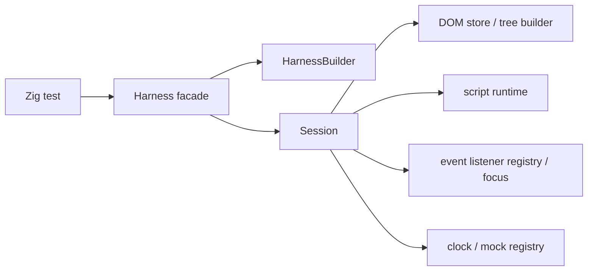

# Architecture

## Intent

`zig/` is a clean-room rewrite workspace for the next generation of `browser-tester`.
The workspace is guided by [`next.md`](../../next.md) and can use the Rust workspace under [`../next/`](../../next) as a reference, but the Zig codebase is the source of truth for this rewrite.

The starting constraints are fixed up front:

- deterministic execution is a product contract
- the public surface stays centered on `Harness`
- ownership is split by subsystem before feature growth
- mocks are first-class test APIs when they become public

## Goals

- Run browser-style tests in a single process.
- Keep time, randomness, and browser-like APIs deterministic.
- Support form-heavy UI tests without launching a real browser.
- Make subsystem ownership visible in code and docs before feature growth starts.

## Non-Goals

- real rendering or layout
- general-purpose network I/O
- service workers
- full iframe semantics
- full browser compatibility
- broad Web API coverage without an explicit capability decision

## Workspace Layout

```text
zig/
  src/
    root.zig        # public facade
    harness.zig     # Harness and HarnessBuilder
    session.zig     # internal session state
    mocks.zig       # internal mock families and registry
    dom.zig         # internal HTML parsing and DOM tree storage
    script.zig      # internal script runtime and host bindings
    errors.zig      # public error surface
  doc/
    architecture.md
    capability-matrix.md
    implementation-guide.md
    limitations.md
    mock-guide.md
    publish-checklist.md
    roadmap.md
    subsystem-map.md
```

## Current Public Surface

- `Harness`
- `HarnessBuilder`
- `StorageSeed`
- `MockRegistry`
- `Error`
- `Result(T)`
- `Harness` now exposes read-only inspection methods, user actions, deterministic clock helpers, and typed test-only mock families.

`Session` stays internal for now.
It owns the copied configuration state, the internal DOM store, the internal script runtime state, the event listener registry, the focused-node snapshot, the fake clock state, and the mock registry.

`Harness` now exposes `assertExists()`, `assertValue()`, `assertChecked()`, and `dumpDom()` for read-only inspection, plus `nowMs()`, `advanceTime()`, `flush()`, `mocksMut()`, `fetch()`, `alert()`, `confirm()`, `prompt()`, `readClipboard()`, `writeClipboard()`, `captureDownload()`, `navigate()`, and `setFiles()` for deterministic runtime control, and `click()`, `typeText()`, `setChecked()`, `setSelectValue()`, `focus()`, `blur()`, `submit()`, and `dispatch()` for user-like actions.
`assertExists()` and the action methods resolve through the shared DOM selector engine, which now covers class selectors, compound simple selectors, descendant combinators, and child combinators.
Inline scripts and event handlers also reuse that selector engine through `document.querySelector()`, `element.querySelector()`, `Element.matches()`, and `Element.closest()`.
Collection lookups reuse it through `document.querySelectorAll()` and `element.querySelectorAll()`, which return minimal `NodeList` snapshots with `length` and `item(index)`.
Inline scripts also use attribute reflection methods like `getAttribute()`, `setAttribute()`, `removeAttribute()`, `hasAttribute()`, and `toggleAttribute()`, which update the shared DOM attribute store and keep selectors plus form-control getters in sync.
Inline scripts also use class and dataset views on `Element` through `className`, `classList`, and `dataset`, which stay aligned with the same shared attribute store.

## High-Level Shape



`Harness` is intentionally thin.
State lives in `Session`, and subsystem files own their internal data.

## Data Ownership Rules

- The public facade should stay narrow.
- Long-lived state belongs to the subsystem that owns it.
- `HarnessBuilder` only collects input and assembles an owned `Session`.
- `Session` currently owns DOM state, script runtime state, event dispatch state, fake clock state, and mock state, and will later own additional runtime and debug state.
- Public methods should delegate inward instead of growing facade logic.

## Phase Plan

### Phase 0

- project skeleton
- `HarnessBuilder`
- `Session`
- copied configuration state
- error taxonomy
- design docs

### Phase 1

- HTML parser and tree builder
- selector subset
- read-only assertions
- DOM dump helpers

The tree builder, selector subset, and public read-only inspection slices are implemented in this workspace now.

### Phase 2

- script lexer, parser, evaluator
- `window`, `document`, and `Element` bindings
- inline script bootstrapping

The script runtime minimum slice is implemented in this workspace now.

### Phase 3

- event dispatch with capture and bubbling
- cancelable default actions
- form controls and user actions

The event/default-action and form-control slice is implemented in this workspace now.

### Phase 4

- deterministic mock wiring
- fetch, clipboard, dialogs, location, file input, and download capture

The deterministic clock helpers and mock registry slice are implemented in this workspace now.

### Phase 5

- contract tests
- regression suite
- property tests
- publication checklist

The hardening suite is implemented in this workspace now.

### Phase 6

- selector expansion
- class selectors
- descendant and child combinators
- selector hardening

The selector expansion slice is implemented in this workspace now.

### Phase 7

- script DOM query expansion
- collection support

The query selector and collection slices are implemented in this workspace now; selector hardening is already covered by the phase 6 selector engine.

### Phase 8

- DOM mutation and reflection expansion
- attribute reflection
- class and dataset views
- tree mutation primitives
- HTML serialization surfaces
- HTML serialization broadening slice 1 (`insertAdjacentHTML`)

The attribute reflection, class/dataset view, tree mutation, and HTML serialization slices are implemented in this workspace now. The next serialization slice is `template.content.innerHTML` and `DocumentFragment` serialization.

## Current Status

Phase 0, Phase 1, Phase 2, Phase 3, Phase 4, Phase 5, and Phase 6 are delivered in this workspace, the Phase 7 query selector and collection slices are delivered as well, and the Phase 8 attribute reflection, class/dataset view, tree mutation, and HTML serialization slices are delivered. HTML serialization broadening slice 1 (`insertAdjacentHTML`) is also delivered; `template.content.innerHTML` remains planned.
