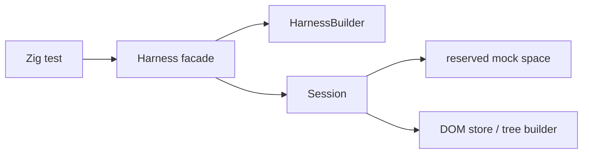

# Architecture

## Intent

`zig/` is a clean-room rewrite workspace for the next generation of `browser-tester`.
The workspace is guided by [`next.md`](../../next.md) and can use the Rust workspace under [`../next/`](../../next) as a reference, but the Zig codebase is the source of truth for this rewrite.

The starting constraints are fixed up front:

- deterministic execution is a product contract
- the public surface stays centered on `Harness`
- ownership is split by subsystem before feature growth
- mocks are first-class test APIs when they become public

## Goals

- Run browser-style tests in a single process.
- Keep time, randomness, and browser-like APIs deterministic.
- Support form-heavy UI tests without launching a real browser.
- Make subsystem ownership visible in code and docs before feature growth starts.

## Non-Goals

- real rendering or layout
- general-purpose network I/O
- service workers
- full iframe semantics
- full browser compatibility
- broad Web API coverage without an explicit capability decision

## Workspace Layout

```text
zig/
  src/
    root.zig        # public facade
    harness.zig     # Harness and HarnessBuilder
    session.zig     # internal session state
    dom.zig         # internal HTML parsing and DOM tree storage
    errors.zig      # public error surface
  doc/
    architecture.md
    capability-matrix.md
    implementation-guide.md
    limitations.md
    mock-guide.md
    publish-checklist.md
    roadmap.md
    subsystem-map.md
```

## Current Public Surface

- `Harness`
- `HarnessBuilder`
- `StorageSeed`
- `Error`
- `Result(T)`

`Session` stays internal for now.
It owns the copied configuration state, the internal DOM store, and is the future home for scheduler state, runtime state, and mock registry state.

## High-Level Shape



`Harness` is intentionally thin.
State lives in `Session`, and subsystem files own their internal data.

## Data Ownership Rules

- The public facade should stay narrow.
- Long-lived state belongs to the subsystem that owns it.
- `HarnessBuilder` only collects input and assembles an owned `Session`.
- `Session` currently owns DOM state and will later own runtime, mock, and debug state.
- Public methods should delegate inward instead of growing facade logic.

## Phase Plan

### Phase 0

- project skeleton
- `HarnessBuilder`
- `Session`
- copied configuration state
- error taxonomy
- design docs

### Phase 1

- HTML parser and tree builder
- selector subset
- read-only assertions
- DOM dump helpers

The tree builder and selector subset slices are implemented internally now; public read-only inspection is still next.

### Phase 2

- script lexer, parser, evaluator
- `window`, `document`, and `Element` bindings
- inline script bootstrapping

### Phase 3

- event dispatch with capture and bubbling
- cancelable default actions
- form controls and user actions

### Phase 4

- deterministic mock wiring
- fetch, clipboard, dialogs, location, file input, and download capture

### Phase 5

- contract tests
- regression suite
- property tests
- publication checklist

### Phase 6

- selector expansion
- class selectors
- descendant and child combinators
- selector hardening

### Phase 7

- script DOM query expansion
- collection support
- bounded selector grammar broadening

### Phase 8

- DOM mutation and reflection expansion
- attribute reflection
- class and dataset views
- HTML serialization surfaces

## Current Status

Phase 0 is delivered, and the internal DOM bootstrap and selector slices of Phase 1 are delivered as well.
The remaining Phase 1 work is public read-only inspection.
