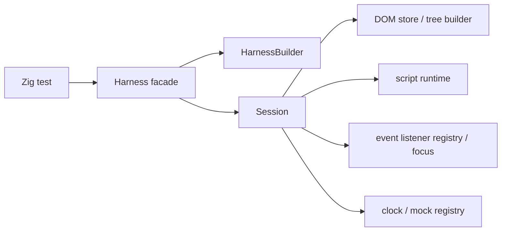

# Architecture

## Intent

`zig/` is a clean-room rewrite workspace for the next generation of `browser-tester`.
The workspace is guided by [`next.md`](../../next.md) and can use the Rust workspace under [`../next/`](../../next) as a reference, but the Zig codebase is the source of truth for this rewrite.

The starting constraints are fixed up front:

- deterministic execution is a product contract
- the public surface stays centered on `Harness`
- ownership is split by subsystem before feature growth
- mocks are first-class test APIs when they become public

## Goals

- Run browser-style tests in a single process.
- Keep time, randomness, and browser-like APIs deterministic.
- Support form-heavy UI tests without launching a real browser.
- Make subsystem ownership visible in code and docs before feature growth starts.

## Non-Goals

- real rendering or layout
- general-purpose network I/O
- service workers
- full iframe semantics
- full browser compatibility
- broad Web API coverage without an explicit capability decision

## Workspace Layout

```text
zig/
  src/
    root.zig        # public facade
    harness.zig     # Harness and HarnessBuilder
    session.zig     # internal session state
    mocks.zig       # internal mock families and registry
    dom.zig         # internal HTML parsing and DOM tree storage
    script.zig      # internal script runtime and host bindings
    errors.zig      # public error surface
  doc/
    architecture.md
    capability-matrix.md
    implementation-guide.md
    limitations.md
    mock-guide.md
    publish-checklist.md
    roadmap.md
    subsystem-map.md
```

## Current Public Surface

- `Harness`
- `HarnessBuilder`
- `StorageSeed`
- `MockRegistry`
- `Error`
- `Result(T)`
- `OpenCall`
- `OpenMocks`
- `CloseCall`
- `CloseMocks`
- `PrintCall`
- `PrintMocks`
- `ScrollMethod`
- `ScrollCall`
- `ScrollMocks`
- `HarnessBuilder` can capture URL, HTML, local storage, session storage, and open/close/print/scroll bootstrap failure seeds before ownership moves into `Session`.
- `Harness` now exposes constructor helpers, read-only inspection methods, user actions, deterministic clock helpers, and typed test-only mock families.

`Session` stays internal for now.
It owns the copied configuration state, the internal DOM store, the internal script runtime state, the event listener registry, the focus/target selector-state snapshots, the fake clock state, and the mock registry.

`Harness` now exposes `assertExists()`, `assertValue()`, `assertChecked()`, and `dumpDom()` for read-only inspection, plus `nowMs()`, `advanceTime()`, `flush()`, `mocksMut()`, `fetch()`, `alert()`, `confirm()`, `prompt()`, `readClipboard()`, `writeClipboard()`, `captureDownload()`, `open()`, `close()`, `print()`, `scrollTo()`, `scrollBy()`, `navigate()`, and `setFiles()` for deterministic runtime control, and `click()`, `typeText()`, `setChecked()`, `setSelectValue()`, `focus()`, `blur()`, `submit()`, and `dispatch()` for user-like actions.
`Harness.open()`, `Harness.close()`, `Harness.print()`, `Harness.scrollTo()`, and `Harness.scrollBy()` forward into the typed open/close/print/scroll mock families so tests can capture popup requests, window shutdown/print invocations, and scroll requests without exposing a browser renderer.
`assertExists()` and the action methods resolve through the shared DOM selector engine, which now covers class selectors, universal selectors, compound simple selectors, descendant combinators, child combinators, sibling combinators, `:scope`, `:has(...)`, `:lang(...)`, `:dir(...)`, `:not(...)`, `:is(...)`, `:where(...)`, `:focus`, `:focus-within`, `:target`, `:defined`, bounded `:nth-*` forms including `of <selector-list>` support on the `nth-child`, `nth-last-child`, `nth-of-type`, and `nth-last-of-type` families, and a bounded structural/state pseudo-class slice.
Inline scripts and event handlers also reuse that selector engine through `document.querySelector()`, `element.querySelector()`, `Element.matches()`, and `Element.closest()`.
Collection lookups reuse it through `document.querySelectorAll()` and `element.querySelectorAll()`, which return minimal `NodeList` snapshots with `length`, `item(index)`, `forEach(callback[, thisArg])`, `keys()`, `values()`, and `entries()`; `document.scripts` and `document.anchors` expose live `HTMLCollection` surfaces with `length`, `item(index)`, `namedItem(name)`, `keys()`, `values()`, and `entries()`; `document.forms`, `form.elements`, `select.options`, `select.selectedOptions`, `fieldset.elements`, `datalist.options`, `map.areas`, `table.tBodies`, `document.images`, `document.links`, `document.embeds`, `document.plugins`, `document.applets`, and `document.all` expose live collection surfaces with the same bounded `HTMLCollection` model, while `document.styleSheets` exposes a live `StyleSheetList` surface with `length`, `item(index)`, `keys()`, `values()`, and `entries()` and `table.rows` / `tbody.rows` / `thead.rows` / `tfoot.rows` / `tr.cells` expose live row and cell `HTMLCollection` surfaces; `getElementsByTagName()`, `getElementsByTagNameNS()`, and `getElementsByClassName()` expose live `HTMLCollection` surfaces on `Document` and `Element`, while `document.getElementsByName()` exposes a live `NodeList` surface on `Document`; `element.labels` exposes a live `NodeList` on labelable controls and `fieldset`; and `Element.children`, `document.children`, `document.childNodes`, `element.childNodes`, and `template.content` expose live child-element / child-node surfaces with the same bounded collection model; `select.options` also accepts `add(option)` / `remove(index)` mutation helpers. Inline bootstrap also exposes `document.currentScript` and `document.readyState` while scripts are executing.
Inline scripts also use attribute reflection methods like `getAttribute()`, `setAttribute()`, `removeAttribute()`, `hasAttribute()`, and `toggleAttribute()`, which update the shared DOM attribute store and keep selectors plus form-control getters in sync.
Inline scripts also use class and dataset views on `Element` through `className`, `classList`, and `dataset`, which stay aligned with the same shared attribute store.
Inline scripts also use document/window alias surfaces on `Document`, `Window`, and `Element` through `document.documentElement`, `document.head`, `document.body`, `document.title`, `document.location`, `document.URL`, `document.documentURI`, `document.baseURI`, `document.origin`, `window.children`, `window.scrollX`, `window.scrollY`, `window.pageXOffset`, `window.pageYOffset`, `window.name`, `window.title`, `window.location`, `window.origin`, `Element.baseURI`, and `Element.origin`; `document.title` assignments stay wired into the copied session state, and `document.location` / `window.location` act as limited `Location` host objects with `href`, `assign()`, `replace()`, and `reload()`. `window.history` is also exposed as a limited `History` host object with `length`, `state`, `back()`, `forward()`, `go(delta)`, `pushState(state, title, url)`, and `replaceState(state, title, url)`, while `history.state` keeps a minimal payload snapshot in this workspace: `null` / `undefined` stay `null`, and other values are stringified.
Inline scripts also use storage surfaces on `Window` through `window.localStorage` and `window.sessionStorage`; both are backed by deterministic mock registry seeds and stay wired into the copied session state.
Inline scripts also use `window.open()`, `window.close()`, `window.print()`, `window.scrollTo()`, and `window.scrollBy()` through the same deterministic mock registry; bootstrap failure seeds from `HarnessBuilder.openFailure()`, `HarnessBuilder.closeFailure()`, `HarnessBuilder.printFailure()`, and `HarnessBuilder.scrollFailure()` can reject those calls during inline script execution.

## High-Level Shape



`Harness` is intentionally thin.
State lives in `Session`, and subsystem files own their internal data.

## Data Ownership Rules

- The public facade should stay narrow.
- Long-lived state belongs to the subsystem that owns it.
- `HarnessBuilder` only collects input and assembles an owned `Session`.
- `Session` currently owns DOM state, script runtime state, event dispatch state, fake clock state, and mock state, and will later own additional runtime and debug state.
- Public methods should delegate inward instead of growing facade logic.

## Phase Plan

### Phase 0

- project skeleton
- `HarnessBuilder`
- `Session`
- copied configuration state
- error taxonomy
- design docs

### Phase 1

- HTML parser and tree builder
- selector subset
- read-only assertions
- DOM dump helpers

The tree builder, selector subset, and public read-only inspection slices are implemented in this workspace now.

### Phase 2

- script lexer, parser, evaluator
- `window`, `document`, and `Element` bindings
- inline script bootstrapping

The script runtime minimum slice is implemented in this workspace now.

### Phase 3

- event dispatch with capture and bubbling
- cancelable default actions
- form controls and user actions

The event/default-action and form-control slice is implemented in this workspace now.

### Phase 4

- deterministic mock wiring
- fetch, clipboard, dialogs, location, file input, and download capture

The deterministic clock helpers and mock registry slice are implemented in this workspace now.

### Phase 5

- contract tests
- regression suite
- property tests
- publication checklist

The hardening suite is implemented in this workspace now.

### Phase 6

- selector expansion
- class selectors
- descendant and child combinators
- sibling combinators
- `:scope`
- `:has(...)`
- `:lang(...)` / `:dir(...)`
- `:not(...)` / `:is(...)` / `:where(...)`
- bounded structural/state pseudo-classes
- selector hardening

The selector expansion slice is implemented in this workspace now.

### Phase 7

- script DOM query expansion
- collection support

The query selector and collection slices are implemented in this workspace now; selector hardening is already covered by the phase 6 selector engine.

### Phase 8

- DOM mutation and reflection expansion
- attribute reflection
- class and dataset views
- tree mutation primitives
- HTML serialization surfaces
- HTML serialization broadening slice 1 (`insertAdjacentHTML`)
- HTML serialization broadening slice 2 (`template.content.innerHTML` / `DocumentFragment` serialization)

The attribute reflection, class/dataset view, inline style declaration, tree mutation, HTML serialization, and namespace-aware serialization slices are implemented in this workspace now, and collection API broadening slices 1 (`NodeList.forEach`), 2 (`document.scripts`), 3 (`document.anchors`), 4 (`NodeList.keys()` / `NodeList.values()` / `HTMLCollection.keys()` / `HTMLCollection.values()`), 5 (`Element.children` / `document.children` / `document.childNodes` / `element.childNodes` / `template.content.childNodes` / `template.content.children`), 6 (`document.forms`), 7 (`form.elements`), 8 (`select.options`), 9 (`select.selectedOptions`), 10 (`fieldset.elements`), 11 (`datalist.options`), 12 (`map.areas`), 13 (`table.tBodies`), 14 (`element.labels`), 15 (`document.images` / `document.links` / `document.embeds` / `document.plugins` / `document.applets` / `document.all`), 16 (`document.styleSheets`), 17 (`table.rows` / `tbody.rows` / `thead.rows` / `tfoot.rows` / `tr.cells`), and 18 (`getElementsByTagName` / `getElementsByTagNameNS` / `getElementsByClassName` / `getElementsByName`) are implemented as well. The focus/target/nth pseudo-class slices (`:focus`, `:focus-within`, `:target`, and bounded `:nth-*` forms) are implemented as well; broader CSS parsing beyond the bounded selector engine remains deferred until a specific user-visible gap needs it. The inline style declaration slice now also strips CSS comments, preserves `!important` priority during serialization, and exposes `getPropertyPriority(...)`.

### Phase 9

- document and window alias surfaces
- `document.documentElement`, `document.head`, `document.body`, `document.activeElement`, `document.referrer`, `document.dir`, `window.children`, and `window.name`
- `document.title` and `window.title`
- `document.location` and `window.location` as limited `Location` host objects
- `document.URL`, `document.documentURI`, `document.baseURI`, `document.compatMode`, `document.characterSet`, `document.charset`, and `document.contentType`
- `document.origin`, `window.origin`, `Element.baseURI`, and `Element.origin`

The document and window alias slice is implemented in this workspace now, including the metadata aliases, `document.referrer`, `document.dir`, `window.children`, and `window.name` aliases used during inline script bootstrap.

### Phase 10

- limited history navigation model
- `window.history`
- `history.length` and `history.state`
- `back()`, `forward()`, and `go(delta)`
- `pushState(...)` and `replaceState(...)`

The limited history navigation slice is implemented in this workspace now.

## Current Status

Phase 0, Phase 1, Phase 2, Phase 3, Phase 4, and Phase 5 are delivered in this workspace, the Phase 6 selector expansion slice is delivered as well, the sibling combinator selector slice is delivered too, the `:scope` pseudo-class slice is delivered, the `:has(...)` pseudo-class slice is delivered, the `:lang(...)` / `:dir(...)` pseudo-class slices are delivered, the `:not(...)` / `:is(...)` / `:where(...)` selector-list pseudo-class slice is delivered, the bounded structural/state pseudo-class slice is delivered, the `:defined` pseudo-class slice is delivered, the focus/target/nth pseudo-class slices are delivered, including `of <selector-list>` support on the `nth-child`, `nth-last-child`, `nth-of-type`, and `nth-last-of-type` families, the Phase 7 query selector and collection slices are delivered, the Phase 8 attribute reflection, class/dataset view, tree mutation, HTML serialization, and namespace-aware serialization slices are delivered, the Phase 9 document/window alias slice is delivered, and the Phase 10 limited navigation slice is delivered. HTML serialization broadening slice 1 (`insertAdjacentHTML`) and slice 2 (`template.content.innerHTML` / `DocumentFragment` serialization) are also delivered; collection API broadening slices 1 (`NodeList.forEach`), 2 (`document.scripts`), 3 (`document.anchors`), 4 (`NodeList.keys()` / `NodeList.values()` / `HTMLCollection.keys()` / `HTMLCollection.values()` / `entries()`), 5 (`Element.children` / `document.children` / `document.childNodes` / `element.childNodes` / `template.content.childNodes` / `template.content.children`), 6 (`document.forms`), 7 (`form.elements`), 8 (`select.options`), 9 (`select.selectedOptions`), 10 (`fieldset.elements`), 11 (`datalist.options`), 12 (`map.areas`), 13 (`table.tBodies`), 14 (`element.labels`), 15 (`document.images` / `document.links` / `document.embeds` / `document.plugins` / `document.applets` / `document.all`), 16 (`document.styleSheets`), 17 (`table.rows` / `tbody.rows` / `thead.rows` / `tfoot.rows` / `tr.cells`), 18 (`getElementsByTagName` / `getElementsByTagNameNS` / `getElementsByClassName` / `getElementsByName`), 19 (`entries()` helpers across `NodeList`, `HTMLCollection`, `StyleSheetList`, and `RadioNodeList`), and 20 (`select.options.add()` / `select.options.remove()`) are delivered, and broader CSS parsing beyond the bounded selector engine remains deferred until a specific user-visible gap needs it. The document/window alias slice now also includes `document.compatMode`, `document.characterSet`, `document.charset`, `document.contentType`, `document.referrer`, `document.dir`, `document.activeElement`, `window.name`, and `window.children` alongside the existing document, location, and origin aliases.
`RadioNodeList.value` is writable in the same form-elements slice, and unmatched assignments clear the checked radio group in this workspace.
